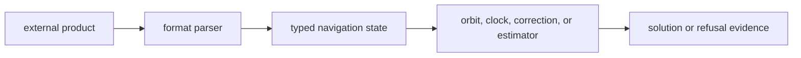

# Formats

`bijux-gnss-nav` owns navigation-domain parsers that turn external products into
typed GNSS state. These formats are not generic I/O; they encode navigation
state, clocks, antenna calibrations, observation records, and signal biases.

## Format Flow

## Format Families

| family | owned behavior |
| --- | --- |
| GPS LNAV and CNAV | Broadcast navigation decoding with explicit reference-week context where needed. |
| Galileo FNAV and INAV | Broadcast data parsing and time/product interpretation. |
| BeiDou broadcast navigation | D1/D2 navigation parsing and reference-week handling. |
| GLONASS navigation | GLONASS-specific time, frequency, and state handling. |
| RINEX navigation and observation | Domain parsing into navigation and observation records. |
| SP3, CLK, ANTEX, bias SINEX | Precise orbit, clock, antenna, and bias product interpretation. |

## Boundary Rules

- Repository file discovery belongs in infrastructure or CLI layers.
- Parser semantics belong here once bytes or text reach the navigation crate.
- Persisted artifact naming and operator-facing command flags are outside this
  crate's scope.
- Ambiguous broadcast time fields need explicit reference context rather than
  hidden defaults.

## Review Checks

- New parsers need malformed-input tests and realistic fixture coverage.
- Time-system and week-rollover behavior must be documented and tested.
- Parsed records should expose refusal or missing-product evidence instead of
  silently fabricating state.
