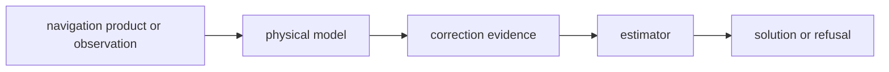

# Models

`bijux-gnss-nav` owns physical and environmental models that directly support
navigation corrections and estimators. These are not generic utilities; they
are navigation-domain evidence used to explain or correct range, phase, timing,
and geometry.

## Model Flow

## Model Families

| family | source | navigation role |
| --- | --- | --- |
| antenna | `src/models/antenna.rs` | receiver and satellite phase-center corrections |
| atmosphere | `src/models/atmosphere.rs`, `src/models/nequick/` | troposphere and ionosphere support used by correction paths |
| celestial | `src/models/celestial.rs` | sun and moon support for physical effects |
| ocean tide loading | `src/models/ocean_tide_loading.rs` | site-displacement correction evidence |
| solid earth tide | `src/models/solid_earth_tide.rs` | Earth tide displacement correction evidence |

## Contract Rules

- A model belongs here only when it directly supports navigation correction,
  estimation, or validation.
- Units must be explicit at the public boundary; hidden unit conversion is a
  navigation-quality risk.
- Models should return evidence that downstream reports can inspect, not just a
  corrected scalar with no provenance.
- Testkit may carry independent model variants for tests, but production
  navigation model ownership stays here.

## Not Owned Here

- raw signal propagation or replica generation belongs to `bijux-gnss-signal`
- receiver scheduling and tracking loops belong to `bijux-gnss-receiver`
- shared test truth belongs to `bijux-gnss-testkit`
- persisted artifact layout belongs to `bijux-gnss-infra`

## Proof Surfaces

- `src/models/`
- correction integration tests under `crates/bijux-gnss-nav/tests/`
- PPP, RTK, antenna, atmosphere, and public-reference tests
