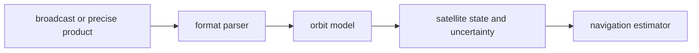

# Orbits

`bijux-gnss-nav` owns the interpretation of broadcast and precise orbital state
for the workspace. Orbit code turns navigation products into typed satellite
state that estimators and correction models can consume.

## Orbit Flow

## Owned Surfaces

| surface | responsibility |
| --- | --- |
| broadcast ephemeris | Interpret constellation-specific broadcast fields, including GPS week context and clock parameters. |
| precise products | Represent satellite states from precise orbit products without hiding product gaps. |
| GLONASS orbit behavior | Preserve GLONASS-specific state, frequency-slot, and time-system handling where required. |
| satellite-state adapters | Produce typed state records downstream estimators can use without parsing product internals. |
| uncertainty helpers | Carry state quality evidence into solver and refusal decisions. |

## Boundary Rules

- Orbit handling starts after product discovery. Repository file lookup belongs
  to infrastructure or command workflows.
- Orbit code owns state interpretation, not receiver-stage scheduling or channel
  selection.
- Broadcast formats with ambiguous week or time fields need explicit reference
  context.
- Missing, stale, or unsupported products must produce visible refusal or
  degraded evidence; they must not silently fall back to invented state.

## Review Checks

- New orbit support needs product parser tests and state-propagation tests.
- New constellation behavior needs explicit time-system and frame assumptions.
- Any new satellite-state uncertainty field needs a consumer or documented
  refusal decision that uses it.
