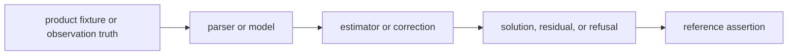

# Tests

`bijux-gnss-nav` has a broad verification surface because it combines format
parsing, physical models, corrections, time systems, estimators, and integrity
claims. Tests here prove navigation science, not receiver runtime orchestration.

## Test Flow

## Major Test Families

| family | protects |
| --- | --- |
| decoders and parsers | GPS, Galileo, BeiDou, GLONASS, RINEX, SP3, CLK, ANTEX, and bias products. |
| orbit and clock references | State propagation, time interpretation, and precision expectations. |
| corrections | Atmosphere, ionosphere, bias, dual-frequency, antenna, windup, and combination behavior. |
| SPP, PPP, RTK, and integrity | Solution accuracy, refused claims, protection levels, ambiguity behavior, and residuals. |
| public data and station truth | Realistic reference inputs used across navigation validation. |
| guardrail and stability tests | Package boundary, deterministic behavior, and long-run numerical stability. |

## Support Fixtures

- `tests/data/` contains checked-in public-data references and precise-product
  fixtures.
- `tests/support/` contains shared truth and reference helpers.
- Golden fixture tests lock decoder fixture behavior and parser assumptions.

## Review Checks

- New parsers need malformed-input and realistic-fixture tests.
- New estimators need accepted, degraded, and refused cases.
- Tests should preserve physical units, time systems, and coordinate frames in
  assertion messages or fixture names.
