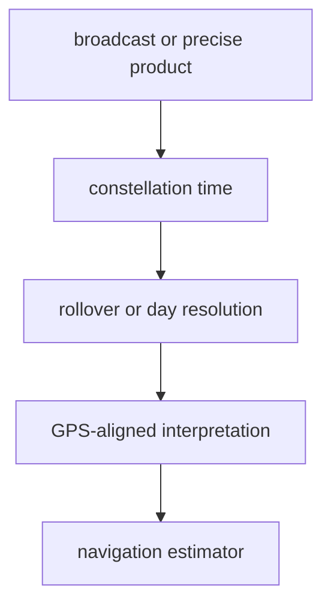

# Time

`bijux-gnss-nav` owns navigation-specific time interpretation beyond the
foundational time contracts in `bijux-gnss-core`. Core owns reusable time
records; navigation owns how external products, constellation clocks, and
rollover rules are interpreted for orbit and solution work.

## Time Flow

## Owned Responsibilities

- GNSS-system-specific records for Galileo, BeiDou, and GLONASS time
- time-offset evidence and conversion wrappers used by navigation products
- civil-time parsing when tied to navigation-product interpretation
- week-rollover resolution and GLONASS day resolution in `src/time/rollover.rs`

## Contract Rules

- Foundational units and reusable time records must stay in core. Put logic here
  only when it depends on navigation-product interpretation.
- Rollover resolution must be explicit about the reference epoch used to choose
  the unambiguous week or day.
- Product parsers should preserve enough time evidence for tests and reports to
  explain a refusal or correction.
- Do not hide constellation-specific offsets inside estimator code; route them
  through this time surface or a documented navigation-product parser.

## Not Owned Here

- generic time wrappers and shared receiver records belong to `bijux-gnss-core`
- sample-clock and receiver-frame timing belong to `bijux-gnss-receiver`
- command-line timestamp presentation belongs to `bijux-gnss`

## Proof Surfaces

- `src/time.rs`
- `src/time/rollover.rs`
- broadcast orbit, CLK, SP3, GLONASS, Galileo, and BeiDou integration tests
