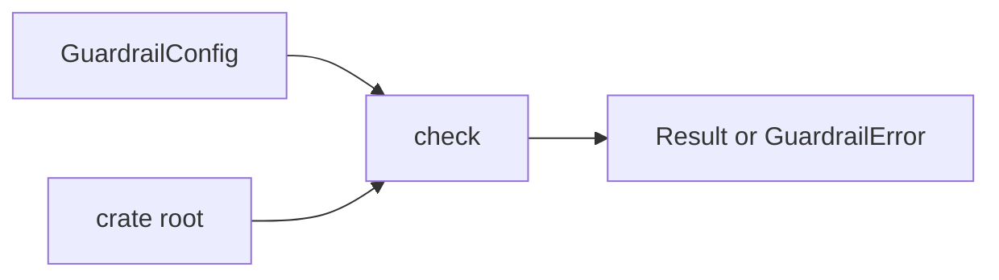

# bijux-gnss-policies API

`bijux-gnss-policies` exposes executable repository guardrails. The public API
is small because policy evaluation has one job: read a crate tree with an
explicit guardrail configuration, then return a structured result that tests and
maintainer tools can report.

## Import Surface

| item | purpose | reader expectation |
| --- | --- | --- |
| `check(crate_root, config)` | Runs the configured guardrails against one crate root. | It does not mutate files or infer workspace-wide intent. |
| `GuardrailConfig` | Describes source-tree, public-surface, and content-policy rules. | It is the durable input contract for tests and policy runners. |
| `GuardrailError` | Carries a specific policy failure. | It is meant to be surfaced as actionable review feedback. |
| `Result` | Package-local result alias. | It keeps callers from depending on internal error wiring. |

## Owned Contract

- Guardrail execution is read-only over product crates.
- Configuration is explicit; callers choose the rules they want evaluated.
- Errors identify repository-structure problems, not runtime product failures.
- Public API growth must serve reusable policy execution, not ad hoc reporting.

## Not Part Of This API

- Product crate semantics such as signal math, navigation estimation, receiver
  stage behavior, or CLI command UX.
- Release automation and generated standard synchronization.
- A general-purpose filesystem linter unrelated to GNSS repository boundaries.

## Review Checks

- A new exported item needs a policy runner or typed policy configuration use
  case.
- Policy checks must stay deterministic and reviewable from source files.
- Error messages need enough location and rule context for a maintainer to fix
  the failing surface without reading implementation internals first.
