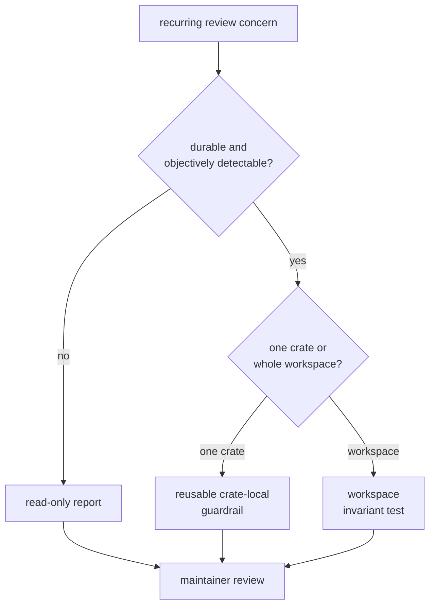
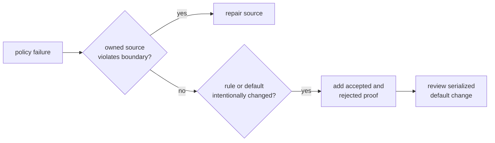

# bijux-gnss-policies

`bijux-gnss-policies` turns selected repository architecture rules into
executable checks. It protects source-tree shape, curated API boundaries,
content restrictions, dependency direction, and policy configuration. It is a
repository-only crate and never participates in GNSS runtime.

Use it when a rule is objective enough that a maintainer should receive the
same pass or failure every time. Keep judgment-heavy concerns in review until
their accepted and rejected cases can be stated precisely.

## Decide Whether A Concern Is Ready For Enforcement

A guardrail should name a stable boundary, point to the offending location,
and leave the maintainer with a concrete action. A metric without a decision
belongs in a report, not a failing policy.

## The Reusable Engine Is Deliberately Small

Downstream policy tests import four items from
`bijux_gnss_policies::api`:

| Item | Contract |
| --- | --- |
| `check` | inspect one explicit crate root with one configuration and stop at the first failure |
| `GuardrailConfig` | select limits, opt-in rules, purity zones, and narrow exceptions |
| `GuardrailError` | distinguish filesystem or regex failures from policy violations |
| `Result` | expose the crate’s error type without internal wiring |

The engine walks source files and applies source-tree, API-surface, and textual
rules. Workspace integration tests add checks that need Cargo metadata or
knowledge of several packages. Calling the reusable engine alone does not prove
the full workspace policy.

The [guardrail reference](docs/GUARDRAILS.md) describes active rule families,
and the [configuration contract](docs/CONFIGURATION.md) explains which checks
are default, opt-in, or parameterized.

## Diagnose The Boundary Before Editing Policy

When a policy test fails:

1. Read the named package, file, token, dependency edge, or limit.
2. Identify the responsibility the rule protects.
3. Repair the owned source before assuming the matcher is obsolete.
4. For a dependency failure, decide whether ownership moved before changing an
   allowlist.
5. For a default snapshot difference, explain why every consumer should receive
   the new policy.
6. Add an exception only when one narrow, durable location cannot satisfy the
   general rule.

Raising a global limit for one package weakens unrelated packages. A local
exception is preferable only when the exception itself documents a durable
architectural reason.

## Know What Text Checks Cannot Prove

The engine and several workspace tests use filesystem walks, regular
expressions, token searches, and Cargo metadata. They can reliably catch the
specific shapes and strings they recognize. They cannot prove:

- Rust name resolution, type behavior, or compiler lint semantics;
- equivalent code written in a form the matcher does not recognize;
- scientific correctness or runtime behavior;
- architectural meaning that exists only in a comment;
- absence of every possible cross-layer dependency.

These checks complement compilation, linting, runtime tests, scientific
evidence, and review. Do not describe a green structural guardrail as proof of
product correctness.

## Policy Defaults Are A Reviewed Contract

The default configuration has a checked-in serialized snapshot. A diff can mean
a new rule, renamed field, changed limit, changed exception shape, or changed
default behavior for every consumer. Do not refresh it simply because a test
asks for new bytes.

The [snapshot guide](docs/SNAPSHOTS.md) defines the review questions. Any policy
change should also include matcher-focused accepted and rejected cases,
actionable failure text, and aligned [test evidence](docs/TESTS.md).

The crate also provides a read-only purity report for structural observation.
Its counts do not mutate source and do not enforce policy. Promote a report
concern only after the repository can defend a durable threshold.

Reader-visible rule and default changes belong in the
[package release history](CHANGELOG.md). The package is not published; its
compatibility matters because every workspace crate consumes its checks.
