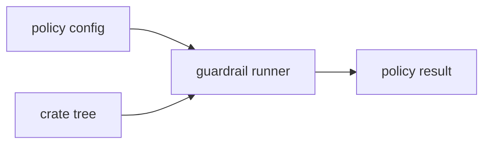

# bijux-gnss-policies

`bijux-gnss-policies` owns executable structural policy for the GNSS
repository. It is the code that makes package boundaries, dependency direction,
public-surface rules, and content policy reviewable instead of tribal
knowledge.

Start here when a repository-shape assertion fails or when a crate needs a
shared guardrail runner. Do not start here for product runtime behavior, GNSS
scientific semantics, maintainer command UX, or release automation.

## Reader Route

| question | go next |
| --- | --- |
| Which guardrail ran? | [docs/GUARDRAILS.md](docs/GUARDRAILS.md), `src/guardrails/` |
| Which configuration drives it? | [docs/CONFIGURATION.md](docs/CONFIGURATION.md) |
| Which public API is reusable? | [docs/PUBLIC_API.md](docs/PUBLIC_API.md), `src/api.rs` |
| Which snapshot or report must be reviewed? | [docs/SNAPSHOTS.md](docs/SNAPSHOTS.md), [docs/REPORTING.md](docs/REPORTING.md) |
| What changed in this package? | [CHANGELOG.md](CHANGELOG.md) |

## Owned Boundary

- crate-local guardrail execution through `check(crate_root, config)`
- typed guardrail configuration for source-tree and public-surface rules
- workspace policy tests for dependency direction, import layering, and
  repository structure
- read-only purity reporting for maintainers

This crate does not own product runtime behavior, GNSS scientific semantics, or
general repository automation unrelated to architecture policy.



## Source Map

- `src/guardrails/` owns source-tree, API-surface, and content-policy checks.
- `src/api.rs` is the curated downstream entrypoint.
- `src/bin/purity_report.rs` owns read-only reporting over workspace crate
  purity characteristics.
- `tests/` owns repository-wide structural assertions and policy snapshots.

## Documentation Map

- [docs/ARCHITECTURE.md](docs/ARCHITECTURE.md)
- [docs/BOUNDARY.md](docs/BOUNDARY.md)
- [docs/CHANGE_RULES.md](docs/CHANGE_RULES.md)
- [docs/CONFIGURATION.md](docs/CONFIGURATION.md)
- [docs/CONTRACTS.md](docs/CONTRACTS.md)
- [docs/GUARDRAILS.md](docs/GUARDRAILS.md)
- [docs/REPORTING.md](docs/REPORTING.md)
- [docs/SNAPSHOTS.md](docs/SNAPSHOTS.md)
- [docs/PUBLIC_API.md](docs/PUBLIC_API.md)
- [docs/TESTS.md](docs/TESTS.md)

## Verification Focus

Use policy tests for structural changes:

```sh
cargo test -p bijux-gnss-policies --test integration_dep_rules
cargo test -p bijux-gnss-policies --test integration_workspace
cargo test -p bijux-gnss-policies --test integration_policy_snapshot
```

Repository-wide lanes and package routing are documented in
[../../README.md](../../README.md).
