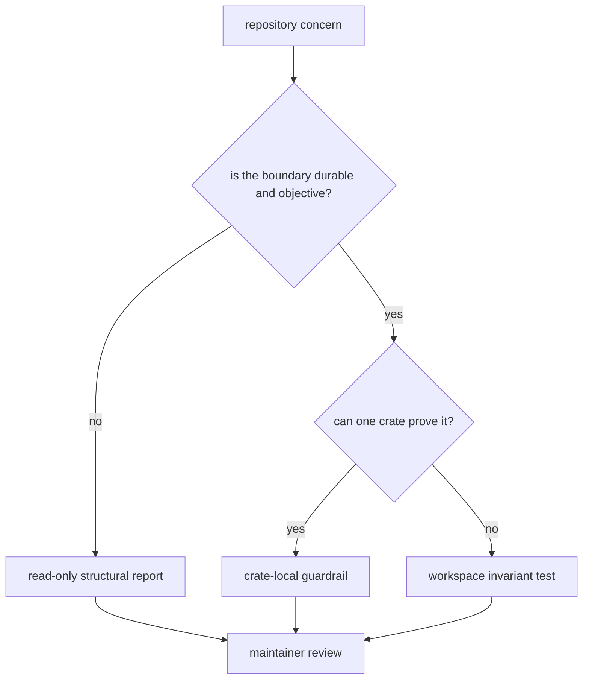
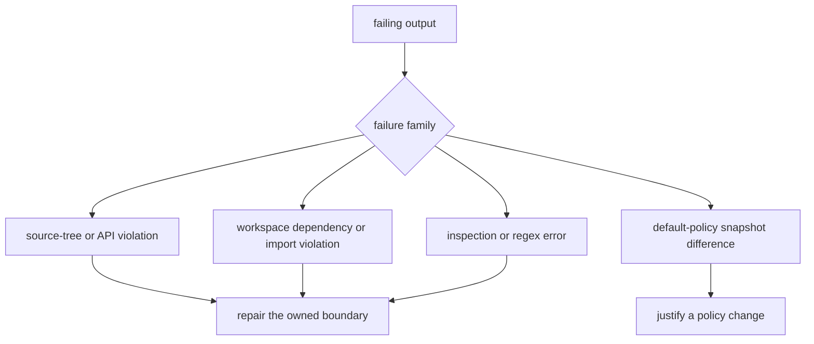

# bijux-gnss-policies

`bijux-gnss-policies` makes repository architecture executable. It checks crate
source shape, curated API discipline, selected content rules, workspace
dependency direction, and cross-package ownership boundaries. The crate is
repository-only: it inspects product code but never participates in GNSS
runtime.

Start here after a policy test fails or before turning a recurring review
decision into an enforced rule.

## Choose Enforcement Deliberately



- Use a crate-local guardrail for source topology, API exposure, naming, or
  content constraints that can be evaluated from one crate root.
- Use a workspace invariant test for dependency edges, imports, package
  coverage, or ownership spanning multiple crates.
- Use a report while a concern still needs human interpretation. Promote it
  only when the repository can state one durable pass/fail condition.

Product behavior, scientific accuracy, release automation, and command
experience need their own owners and evidence.

## Public Contract

Consumers use four items from the
[curated policy API](src/api.rs):

| item | responsibility |
| --- | --- |
| `check` | evaluate enabled crate-local rules against an explicit crate root |
| `GuardrailConfig` | select limits, opt-in checks, purity zones, and narrow exceptions |
| `GuardrailError` | distinguish inspection failures from actionable policy violations |
| `Result` | keep callers independent from internal error wiring |

`check` is read-only and stops at the first failure. Fixing one violation can
therefore expose another on the next run. The
[architecture guide](docs/ARCHITECTURE.md) documents evaluation order and the
boundary between reusable checks, workspace tests, and reporting.

## Interpreting A Failure



1. Read the package, source, token, edge, or limit named in the failure.
2. Treat the owned source as wrong before assuming the check is stale.
3. For dependency failures, decide whether responsibility moved before editing
   the allowlist.
4. For snapshot differences, identify the changed default and explain why every
   consumer should inherit it.
5. Add an exception only when it can name one narrow, durable location.

Never raise a global limit to accommodate one package. That converts a local
design problem into weaker policy for the entire workspace.

## What The Checks Can Prove

The reusable engine inspects source text and filesystem structure. Workspace
tests also use Cargo metadata where dependency structure matters. These checks
can expose forbidden imports, misplaced exports, excessive topology, known
tokens, and undeclared dependency edges.

They do not replace:

- Rust name resolution or compiler lints;
- runtime and scientific tests;
- semantic review of comments and architecture;
- proof that a textual matcher recognizes every equivalent program.

The [guardrail reference](docs/GUARDRAILS.md) describes active rule families,
and the [test evidence guide](docs/TESTS.md) states the workspace invariants
currently exercised.

## Changing Policy

A policy change is ready when:

- the protected boundary is written in repository terms;
- accepted and rejected cases prove the matcher;
- failure output gives a maintainer enough context to act;
- configuration defaults and exceptions remain narrow;
- serialized default changes receive explicit
  [snapshot review](docs/SNAPSHOTS.md);
- report fields have a reader action rather than accumulating metrics without a
  decision.

Use the [configuration guide](docs/CONFIGURATION.md) for rule selection and the
[reporting guide](docs/REPORTING.md) when deciding whether a concern is mature
enough to enforce.

## Verification

Run the focused invariant that changed:

```sh
cargo test -p bijux-gnss-policies --test integration_dep_rules
cargo test -p bijux-gnss-policies --test integration_workspace
cargo test -p bijux-gnss-policies --test integration_policy_snapshot
```

Run the complete package suite after changing engine behavior, configuration,
or workspace policy:

```sh
cargo test -p bijux-gnss-policies
```

Reader-visible policy changes belong in the
[package changelog](CHANGELOG.md).
