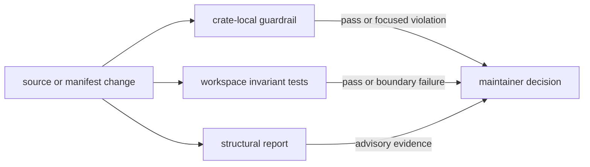
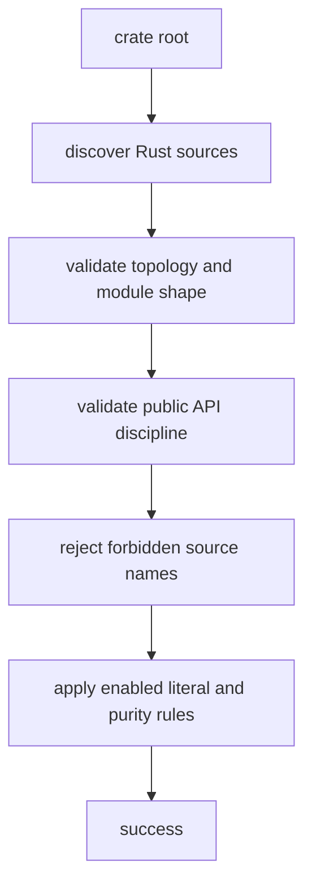
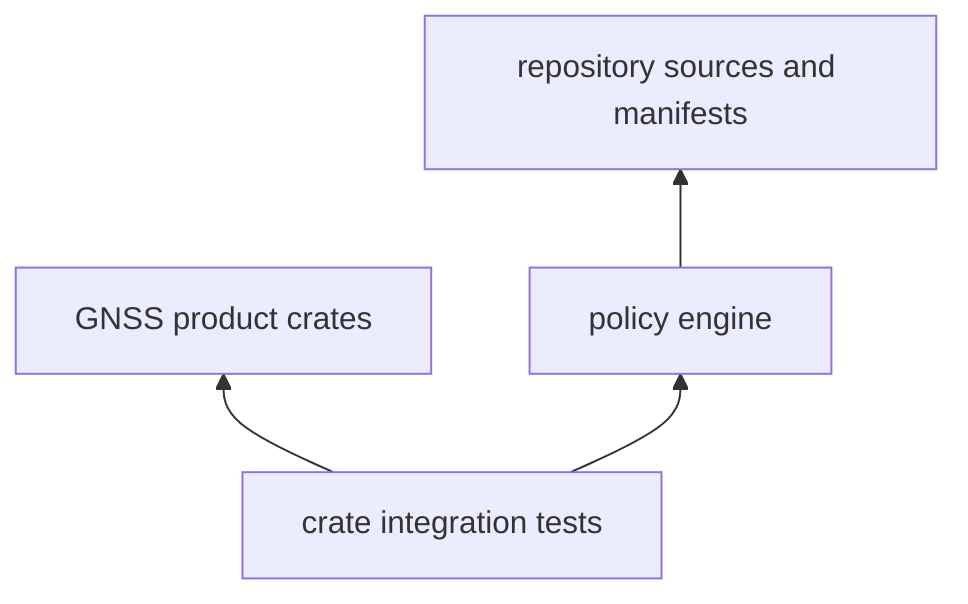

# Architecture

`bijux-gnss-policies` turns repository boundaries into executable checks. It is a
development dependency and inspection tool, not part of the GNSS runtime. Product
code must remain usable without loading this crate.

## Where Policy Runs

The crate has three deliberately different responsibilities:

| responsibility | question answered | result |
| --- | --- | --- |
| crate-local guardrails | Does one crate still follow the source-tree, API, and content rules selected for it? | The first actionable violation, or success. |
| workspace invariant tests | Does the repository still preserve dependency direction and ownership boundaries? | A test failure naming the broken invariant and offending package or source. |
| structural reporting | Where is architectural pressure accumulating before it deserves enforcement? | Read-only evidence for review; never a source rewrite. |

Keeping these paths separate matters. A stable rule belongs in an enforced
guardrail or invariant test. A trend that still needs interpretation belongs in
the report. Product behavior belongs in the owning product crate.

## Guardrail Evaluation

Consumers call `check(crate_root, config)` through the
[curated policy API](../src/api.rs). The evaluator discovers Rust sources once,
then applies checks in a deterministic order:

Evaluation stops at the first error. This keeps output focused, but it also means
a second run may expose another violation after the first is fixed. Filesystem
and regular-expression failures remain distinct from policy violations through
the [guardrail error contract](../src/guardrails/error.rs).

### Rule Ownership

| rule family | enforced behavior | implementation |
| --- | --- | --- |
| source topology | bounded nesting, meaningful module directories, non-empty modules, and non-placeholder names | [source-tree checks](../src/guardrails/source_tree.rs) |
| public surface | bounded public-item density and exports curated through the crate API | [API-surface checks](../src/guardrails/api_surface.rs) |
| source content | optional panic restrictions, delivery-label rejection, and purity-zone patterns | [content-policy checks](../src/guardrails/content_policy.rs) |
| policy selection | defaults, crate-specific exceptions, and opt-in checks | [typed guardrail configuration](../src/guardrails/config.rs) |

The checks inspect source text and layout; they do not replace Rust name
resolution, compiler lints, or dependency metadata checks. Workspace tests own
invariants that need Cargo metadata or relationships between crates.

## Dependency Boundary

- Product crates may use the policy crate from tests, but runtime modules must
  not depend on it.
- The policy crate may read product sources and manifests because inspection is
  its purpose; it must not mutate them.
- Repository-wide assertions stay here only when they protect an architectural
  boundary. General test fixtures belong in `bijux-gnss-testkit`, and command
  orchestration belongs in `bijux-gnss-dev`.
- Package-specific exceptions belong in `GuardrailConfig::for_crate`. An
  exception must identify the narrow owned location; widening a global default
  to accommodate one crate weakens every consumer.

## Adding Or Changing A Rule

Start with the boundary, not the matcher:

1. State the repository condition that must remain true and identify its owner.
2. Decide whether the condition is crate-local, workspace-wide, or advisory.
3. Add the narrowest implementation and an error that identifies the violated
   limit, token, or ownership boundary.
4. Cover both accepted and rejected cases. A matcher tested only against the
   current repository can silently encode accidental layout.
5. If serialized defaults change, review the
   [snapshot contract](SNAPSHOTS.md) rather than refreshing it mechanically.
6. Update the [configuration guide](CONFIGURATION.md) or
   [guardrail reference](GUARDRAILS.md) when reader-visible behavior changes.

A rule is ready when a maintainer can act from its failure output without
reading the matcher, and when an intentional exception can be expressed more
narrowly than disabling the rule.

## Architectural Warning Signs

- A policy check imports GNSS domain types or executes product behavior.
- A report rewrites files or becomes a required runtime step.
- A workspace invariant is implemented as an undocumented text search when
  structured Cargo metadata is available.
- A crate exception raises repository-wide limits.
- Public policy entry points bypass the [curated policy API](../src/api.rs).
- Documentation lists implementation files without explaining which decision
  each one owns.

See the [boundary guide](BOUNDARY.md) for scope and the
[test evidence guide](TESTS.md) for the invariants exercised in CI.
