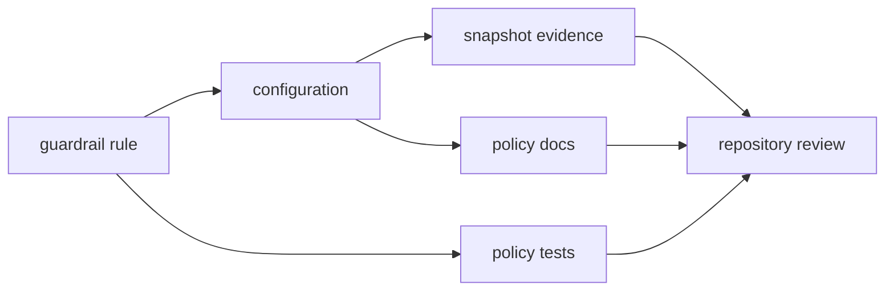

# Change Rules

`bijux-gnss-policies` changes repository behavior even when no product code
moves. A policy change can make a crate pass, fail, or report new structural
risk. That makes documentation and review discipline part of the implementation,
not an afterthought.

## Change Flow

## Required Discipline

| change | required companion work |
| --- | --- |
| new guardrail family | Update the [guardrail guide](GUARDRAILS.md), configuration docs, tests, and public reporting when applicable. |
| changed configuration meaning | Update the [configuration guide](CONFIGURATION.md), snapshots, and any affected failure-message expectations. |
| changed reporting surface | Update the [reporting guide](REPORTING.md) and verify report output remains read-only. |
| changed snapshot | Explain the policy reason in the same change set and avoid accepting generated movement blindly. |
| new public API | Update the [public API](PUBLIC_API.md) and prove the export is reusable policy surface. |

## Wrong-Crate Signals

- The code mutates product state.
- The logic belongs to receiver runtime behavior rather than repository policy.
- A helper exists only to shorten one test and has no reusable guardrail role.
- A rule encodes one crate's current shape instead of a workspace boundary.

## Review Checks

- Is the changed rule defending a durable repository standard?
- Are exceptions narrow and named by the boundary they protect?
- Will downstream crate maintainers understand the new failure without reading
  this crate's internals?
- Do docs and snapshots explain the same policy behavior?
