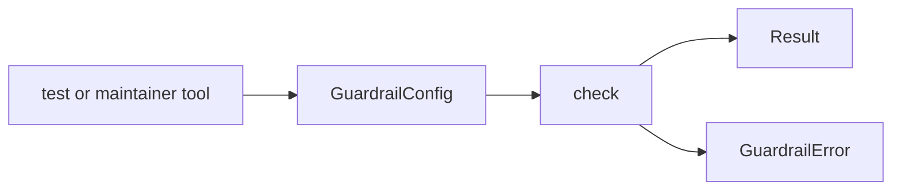

# Public API

`bijux-gnss-policies` publishes one small Rust surface through
`bijux_gnss_policies::api`. The API exists so tests and maintainer tooling can
run guardrails without importing internal rule modules or depending on source
tree layout.

## API Flow

## Exported Items

| export | responsibility |
| --- | --- |
| `check` | Runs guardrail validation for a crate root. |
| `GuardrailConfig` | Describes the rule configuration for a crate. |
| `GuardrailError` | Carries the canonical policy failure type. |
| `Result` | Provides the crate-local result alias for callers. |

## Boundary Rules

- The API is intentionally narrow and read-only.
- Callers choose the crate root and configuration; the policy crate evaluates
  what it is asked to evaluate.
- Internal rule modules stay private until another crate has a durable reason to
  configure or run them directly.
- Product runtime behavior and scientific semantics are not policy API
  concerns.

## Review Checks

- A new export needs a reusable guardrail invocation or configuration use case.
- Public errors need enough context for actionable repository review.
- Do not expose internals to make one test shorter; add helper code in the test
  when the behavior is not a reusable policy contract.
