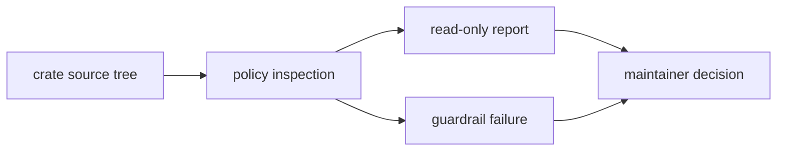

# Reporting

`bijux-gnss-policies` owns failing guardrail output and read-only structural
reports. Reporting is the visibility layer before a concern becomes a hard
policy rule, and it is the explanation layer when an enforced rule fails.

## Reporting Flow

## Read-Only Reporting Surface

`src/bin/purity_report.rs` currently reports:

- crate names discovered under `crates/`
- dependency counts
- selected heavy dependency presence
- public-item distribution between `api.rs` and non-API files
- feature inventory

## Contract Rules

- Reports must not mutate files or rewrite crate structure.
- Reports should expose trends and risks before every concern becomes a
  hard-failing guardrail.
- A report field needs a reader action: inspect, compare, decide, or propose a
  rule.
- Guardrail failures need enough file, rule, and boundary context to be fixed
  from the output.

## Reader Guidance

Use reports when the repository needs visibility without immediate enforcement.
Use guardrails when the boundary is durable enough that violating it should fail
review. If a report repeatedly drives the same manual review decision, promote
the decision into an explicit guardrail.

## Review Checks

- Does each new report field have an obvious maintainer use?
- Does output ordering stay deterministic for review and artifacts?
- Does a proposed report belong to policy, or is it really product runtime,
  release automation, or documentation analysis?
