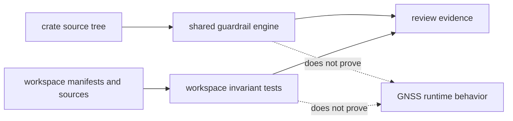
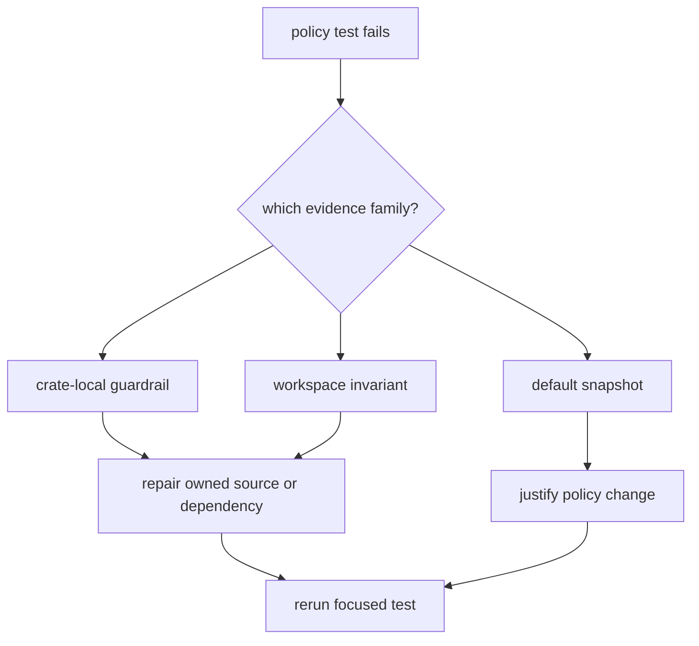

# Test Evidence

The policy suite answers two questions: whether each crate follows the shared
guardrail contract, and whether the workspace still preserves boundaries that no
single crate can prove alone. A green suite is architectural evidence, not a
substitute for product tests.

## Evidence Model



## What The Suite Proves

| invariant | evidence | failure meaning |
| --- | --- | --- |
| every workspace package runs the shared policy engine | [workspace coverage tests](../tests/integration_workspace.rs) and each package's guardrail integration test | A package is outside policy coverage, bypasses package-specific configuration, or weakens a protected default. |
| runtime dependencies follow the approved direction | [dependency rules](../tests/integration_dep_rules.rs) | A package added an undeclared workspace edge, introduced a dependency cycle, or enabled a forbidden navigation feature in the receiver. |
| domain layers do not reach through owned APIs | [cross-layer import checks](../tests/integration_no_cross_layer_imports.rs) | Signal, navigation, or receiver code crossed a package boundary or constructed observations outside their owner. |
| generic command errors stay at command boundaries | [error-dependency policy](../tests/integration_no_anyhow_eyre.rs) | A library package adopted `anyhow` or `eyre` instead of an owned error contract. |
| runtime libraries do not emit unmanaged warnings | [diagnostic policy](../tests/integration_no_ad_hoc_warnings.rs) | Core, navigation, or receiver code emitted warning/error logs outside the repository's diagnostic model. |
| serialized policy defaults change visibly | [default-policy snapshot test](../tests/integration_policy_snapshot.rs) | A default, field name, or serialized policy shape changed and requires policy review. |
| the policy crate obeys its own rules | [self-guardrail test](../tests/integration_guardrails.rs) | Policy implementation drifted from the same source and API constraints imposed on consumers. |

These tests intentionally use different inspection methods. Dependency
direction is derived from Cargo metadata; source ownership rules inspect Rust
sources; default configuration uses a reviewed JSON snapshot. Do not collapse
them into one generic text scanner.

## Running Focused Evidence

Run commands from the repository root. Start with the invariant that failed:

```sh
cargo test -p bijux-gnss-policies --test integration_dep_rules
cargo test -p bijux-gnss-policies --test integration_workspace
cargo test -p bijux-gnss-policies --test integration_policy_snapshot
```

To exercise the reusable engine against the policy crate itself:

```sh
cargo test -p bijux-gnss-policies --test integration_guardrails
```

Run the package's complete suite before committing a policy behavior change:

```sh
cargo test -p bijux-gnss-policies
```

## Interpreting Failures



### Crate-Local Guardrail

Read the violation as a source-ownership problem first. Move an accidental
export behind the curated API, give a placeholder module a durable
responsibility, or remove a forbidden token. Change configuration only when the
source is intentionally exceptional and the exception can name a narrow owned
location.

### Workspace Invariant

Treat the package or source named by the assertion as the starting point, not as
proof that the test is stale. For dependency failures, inspect the new edge and
decide whether ownership is wrong before changing the allowlist. For source
boundary failures, route behavior through the owning crate's public contract.

### Snapshot Difference

The snapshot deliberately omits selected topology limits whose values are not
part of the stable serialized evidence. For every remaining difference:

1. identify the policy behavior represented by the changed field;
2. confirm the new default should affect every consumer;
3. update the [snapshot fixture](../tests/snapshots/guardrail_default.json);
4. explain the changed behavior in the same commit.

The [snapshot guide](SNAPSHOTS.md) describes the review standard. Never accept a
snapshot solely to make the comparison pass.

## Adding Evidence

A new test should name one durable invariant and fail with the offending package,
edge, token, or source. Prefer structured inputs when available, keep allowlists
close to the rule they qualify, and include a rejected case that proves the check
can fail. If the proposed test needs GNSS samples, numerical tolerances, or
runtime fixtures, it belongs in the product or test-support crate rather than
this policy suite.
