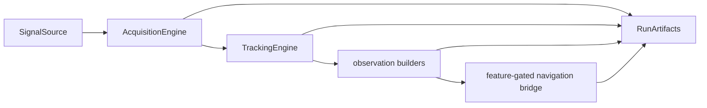

# bijux-gnss-receiver API

`bijux-gnss-receiver` exposes receiver runtime behavior: input ports,
configuration, acquisition, tracking, observation construction, optional
navigation execution, runtime diagnostics, and receiver-produced artifacts.

## API Map

| family | representative items | contract owned here |
| --- | --- | --- |
| configuration | `ReceiverConfig`, `ReceiverPipelineConfig`, threshold policy and navigation selection types | Convert operator or profile configuration into validated receiver execution settings. |
| runtime controls | `ReceiverRuntime`, `ReceiverRuntimeConfig`, `MetricsSink`, `TraceSink`, `NullLogger` | Carry side-effectful logging, metric, trace, and run-context policy at the receiver boundary. |
| I/O ports | `FileSamples`, `MemorySamples`, `SignalSource`, `SampleSource`, `ArtifactSink`, `Clock`, `SystemClock` | Isolate sample input, artifact output, and time sources from stage logic. |
| acquisition | `AcquisitionEngine`, assistance helpers, Doppler/carrier conversion helpers | Detect and seed trackable signals from sample input and search assumptions. |
| tracking | `TrackingEngine`, `TrackingResult`, `TrackingSession`, `ChannelState`, `TrackingArtifacts` | Maintain lock state, code/carrier estimates, CN0, uncertainty, and transition evidence. |
| observations | `observations_from_tracking_results`, quality reports, residual reports, observation artifacts | Convert tracking state into measurement epochs and receiver-side quality evidence. |
| navigation bridge | `Navigation`, `NavigationFilter`, `NavigationEngine`, validation reports behind feature `nav` | Connect receiver artifacts to navigation-owned solvers without relocating navigation science. |
| run result | `RunArtifacts`, `ReceiverEngine`, `Receiver` | Provide a top-level receiver execution contract for callers. |

## Feature Boundaries

Navigation exports are feature-gated behind `nav`. Receiver code can prepare and
validate navigation-stage handoff, but solver internals, correction science, and
advanced solution claims remain owned by `bijux-gnss-nav`.

## Boundary Rules

- Receiver APIs own runtime behavior and evidence emitted by receiver stages.
- Signal catalogs and code-generation primitives belong to `bijux-gnss-signal`.
- Navigation estimation and correction models belong to `bijux-gnss-nav`.
- Repository artifact layout, dataset registry, and command report wording belong
  outside this crate.

## Review Checks

- New public receiver exports need a stage, runtime, port, or artifact owner.
- Any API that can refuse a result needs a typed refusal or diagnostic path.
- New navigation bridge exports must keep feature-gating and owner language
  visible.
