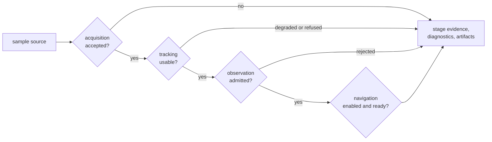

# bijux-gnss-receiver

[](https://crates.io/crates/bijux-gnss-receiver)
[](https://github.com/bijux/bijux-gnss/blob/main/LICENSE)
[](https://github.com/bijux/bijux-gnss)
[](https://crates.io/crates/bijux-gnss-receiver)
[](https://github.com/bijux/bijux-gnss/pkgs/container/bijux-gnss%2Fbijux-gnss-receiver)
[](https://docs.rs/bijux-gnss-receiver/latest/bijux_gnss_receiver/)
[](https://github.com/bijux/bijux-gnss/tree/main/docs/05-bijux-gnss-receiver)

`bijux-gnss-receiver` turns complex samples into typed evidence about
acquisition, tracking, observations, and optional navigation. It owns receiver
configuration, stage orchestration, channel state, runtime diagnostics,
uncertainty, and the artifacts returned by a receiver run.

Choose this crate when you are embedding receiver behavior. Use the command
package for complete operator workflows, signal for reusable codes and DSP,
navigation for standalone estimation science, and infrastructure for durable
run directories and manifests.

## A Run Is A Sequence Of Decisions



Later stages are conditional. A completed call may contain acquisition evidence
without tracking lock, observations without a navigation attempt, or a
navigation refusal rather than a coordinate. Consumers should inspect stage
status and diagnostics, not infer success from the existence of a return value.

## Start From The Evidence You Need

| You need to understand or change... | Read first |
| --- | --- |
| stage order, handoff, and early termination | [Receiver pipeline](docs/PIPELINE.md) |
| configuration defaults, validation, runtime state, or support policy | [Runtime contract](docs/RUNTIME.md) |
| sample sources, clocks, artifact sinks, metrics, or traces | [Runtime ports](docs/PORTS.md) |
| acquisition, tracking, observation, and navigation output fields | [Receiver artifacts](docs/ARTIFACTS.md) |
| deterministic synthetic scenarios and injected truth | [Simulation boundary](docs/SIMULATION.md) |
| comparison with an external reference solution | [Reference validation](docs/REFERENCE_VALIDATION.md) |
| the supported downstream import surface | [Public API](docs/PUBLIC_API.md) |

The public API exports `ReceiverConfig`, `ReceiverPipelineConfig`,
`ReceiverRuntime`, `Receiver`, and `RunArtifacts`, along with focused stage
engines and evidence types. It also re-exports the core and signal APIs for
receiver consumers. Navigation exports appear only when `nav` is enabled.

## Runtime Evidence Is Not Persisted Evidence

`RunArtifacts` reports what the receiver produced in memory: acquisition
results and explanations, tracking transitions and channel reports,
observation decisions and quality reports, the support matrix, and optional
navigation epochs. Diagnostics, metrics, traces, validation reports, and
pipeline step reports are separate receiver evidence surfaces. None of these
defines a stable run directory, manifest history, or repository provenance
record.

Use the [infrastructure package](../bijux-gnss-infra/README.md) when evidence
must survive as a governed run. That package decides locations and persistence;
the receiver remains responsible for the scientific and runtime meaning of the
payload.

Ports keep side effects visible, but their guarantees differ. Sample sources
and artifact sinks can return typed errors. Metrics and trace sinks are
notification interfaces and do not return failures to the receiver. A caller
that needs durable telemetry must provide and supervise that durability outside
the receiver contract.

## Features

| Feature | Effect |
| --- | --- |
| `nav` | enables navigation execution, validation, and navigation re-exports |
| `precise-products` | enables `nav` and forwards precise-product support to navigation |
| `tracing` | enables tracing integration |
| `reference-checks` | adds observation-epoch sequence checks |
| `trace-dump`, `trace-heavy` | add detailed trace evidence |
| `alloc-trace`, `alloc-audit` | add allocation evidence |

Navigation is enabled by default. A receiver-only build can disable default
features without changing ownership of acquisition, tracking, or observations:

```toml
[dependencies]
bijux-gnss-receiver = { version = "0.1.0", default-features = false }
```

The registry dependency describes the prepared `0.1.0` surface; the first
release has not been published.

## Make Claims At The Right Strength

- A detected correlation peak is acquisition evidence, not tracking lock.
- Tracking lock is not proof that observation timing and uncertainty are fit
  for navigation.
- A produced observation is not proof that a position was attempted or valid.
- Synthetic truth demonstrates behavior under declared assumptions, not
  live-sky performance.
- Reference comparison is only as strong as alignment, provenance, and
  tolerance policy.
- Diagnostic and allocation features are evidence tools, not normal runtime
  prerequisites.

The [test evidence guide](docs/TESTS.md) maps each claim to focused integration,
property, synthetic, reference, and guardrail tests. Compatibility changes to
defaults, stage transitions, ports, or artifacts belong in the
[package release history](CHANGELOG.md) and follow the
[receiver release guide](../../docs/05-bijux-gnss-receiver/operations/release-and-versioning.md).
