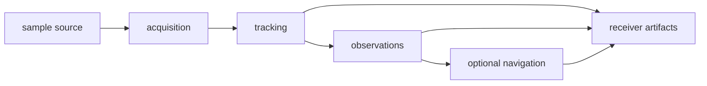

# bijux-gnss-receiver

[](https://crates.io/crates/bijux-gnss-receiver)
[](https://github.com/bijux/bijux-telecom/blob/main/LICENSE)
[](https://github.com/bijux/bijux-telecom)
[](https://crates.io/crates/bijux-gnss-receiver)
[](https://github.com/bijux/bijux-telecom/pkgs/container/bijux-telecom%2Fbijux-gnss-receiver)
[](https://docs.rs/bijux-gnss-receiver/latest/bijux_gnss_receiver/)
[](https://github.com/bijux/bijux-telecom/tree/main/docs/05-bijux-gnss-receiver)

`bijux-gnss-receiver` owns receiver runtime behavior: configuration,
acquisition, tracking, observation generation, optional navigation-stage
execution, diagnostics, and receiver-owned artifacts.

Start here when the question is about how a receiver run behaves at runtime.
Do not start here for signal-code definitions, standalone navigation science,
repository persistence policy, or operator-facing command wording.

## Install

```sh
cargo add bijux-gnss-receiver
```

The Cargo package name is `bijux-gnss-receiver`; its Rust import name is
`bijux_gnss_receiver`. All public packages in this repository share one release
version.

## Reader Route

| question | go next |
| --- | --- |
| How does a run move through stages? | [Pipeline guide](docs/PIPELINE.md), `src/pipeline/` |
| Which runtime knobs and defaults are supported? | [Runtime guide](docs/RUNTIME.md), `src/engine/receiver_config.rs` |
| Which ports isolate clock, source, and sink behavior? | [Port guide](docs/PORTS.md), `src/ports/`, `src/io/` |
| Which reports or artifacts come from receiver execution? | [Artifact guide](docs/ARTIFACTS.md), `src/artifacts.rs`, `src/validation_report.rs` |
| What changed in this package? | [Package changelog](CHANGELOG.md) |

## Owned Boundary

- receiver configuration, defaults, validation, and runtime state
- acquisition, tracking, observation, and optional navigation orchestration
- channel state, lock state, diagnostics, CN0, uncertainty, and refusal evidence
- clock, sample-source, and artifact-sink ports
- receiver-boundary simulation and reference-validation helpers

This crate does not own repository persistence, operator workflow policy,
low-level signal-code generation, or standalone navigation science.



## Source Map

- `src/engine/` owns runtime configuration, logging, metrics, signal selection,
  support matrices, and receiver composition.
- `src/pipeline/` owns staged acquisition, tracking, observations, and optional
  navigation flows.
- `src/io/` and `src/ports/` own source, sink, and clock abstractions.
- `src/artifacts.rs`, `src/validation_report.rs`, and related modules own
  runtime-side outputs.
- `src/sim/` owns synthetic receiver execution helpers.

## Documentation Map

- [Architecture guide](docs/ARCHITECTURE.md)
- [Artifact guide](docs/ARTIFACTS.md)
- [Boundary guide](docs/BOUNDARY.md)
- [Contract guide](docs/CONTRACTS.md)
- [Pipeline guide](docs/PIPELINE.md)
- [Port guide](docs/PORTS.md)
- [Public API](docs/PUBLIC_API.md)
- [Reference validation guide](docs/REFERENCE_VALIDATION.md)
- [Runtime guide](docs/RUNTIME.md)
- [Simulation guide](docs/SIMULATION.md)
- [Test guide](docs/TESTS.md)

## Verification Focus

Use receiver tests that match the changed stage before full-suite proof:

```sh
cargo test -p bijux-gnss-receiver --test integration_basic
cargo test -p bijux-gnss-receiver --test integration_receiver_support_matrix_inventory
cargo test -p bijux-gnss-receiver --test integration_navigation_pvt_accuracy_budget
```

Repository-wide lanes and package routing are documented in the
[workspace README](../../README.md).
