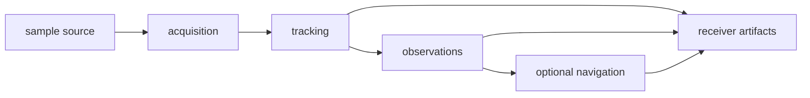

# bijux-gnss-receiver

[](https://crates.io/crates/bijux-gnss-receiver)
[](https://github.com/bijux/bijux-telecom/blob/main/LICENSE)
[](https://github.com/bijux/bijux-telecom)
[](https://crates.io/crates/bijux-gnss-receiver)
[](https://github.com/bijux/bijux-telecom/pkgs/container/bijux-telecom%2Fbijux-gnss-receiver)
[](https://docs.rs/bijux-gnss-receiver/latest/bijux_gnss_receiver/)
[](https://github.com/bijux/bijux-telecom/tree/main/docs/05-bijux-gnss-receiver)

`bijux-gnss-receiver` owns receiver runtime behavior: configuration,
acquisition, tracking, observation generation, optional navigation-stage
execution, diagnostics, and receiver-owned artifacts.

Use this crate when a change affects how samples become acquisition, tracking,
observation, optional navigation, diagnostic, or artifact evidence. Signal
definitions, standalone navigation science, persisted layout, and command
wording remain with their owning crates.

## Availability

The first registry release has not been published. In this workspace, build or
test the package directly:

```sh
cargo test -p bijux-gnss-receiver
```

After publication, add it with `cargo add bijux-gnss-receiver`. The Cargo
package name is `bijux-gnss-receiver`; its Rust import name is
`bijux_gnss_receiver`. All public packages in this repository share one release
version.

## Choose the Runtime Contract

| question | go next |
| --- | --- |
| How do samples move through acquisition, tracking, observations, and navigation? | [pipeline guide](docs/PIPELINE.md) |
| Which configuration, defaults, side effects, and support rules apply? | [runtime guide](docs/RUNTIME.md) |
| Which interfaces isolate clocks, sample sources, and artifact sinks? | [port guide](docs/PORTS.md) |
| Which typed results and reports leave a run? | [artifact guide](docs/ARTIFACTS.md) |
| How do synthetic and reference claims differ? | [simulation guide](docs/SIMULATION.md) and [reference-validation guide](docs/REFERENCE_VALIDATION.md) |
| What compatibility changed? | [package release history](CHANGELOG.md) |

## Owned Boundary

- receiver configuration, defaults, validation, and runtime state
- acquisition, tracking, observation, and optional navigation orchestration
- channel state, lock state, diagnostics, CN0, uncertainty, and refusal evidence
- clock, sample-source, and artifact-sink ports
- receiver-boundary simulation and reference-validation helpers

This crate does not own repository persistence, operator workflow policy,
low-level signal-code generation, or standalone navigation science.



## Observable Runtime Contract

- Configuration defaults and validation determine which work is attempted.
- Acquisition acceptance and tracking transitions remain visible as typed
  evidence, including degraded and refused states.
- CN0, uncertainty, lock, residual, and support claims retain enough context
  for downstream review.
- Runtime side effects pass through explicit clocks, sources, sinks, metrics,
  traces, and log boundaries.
- Navigation remains feature-gated; disabling it must not change signal,
  acquisition, tracking, or observation ownership.
- Receiver artifacts describe what happened in memory. Infrastructure decides
  where durable files, manifests, and histories live.

The [receiver release guide](../../docs/05-bijux-gnss-receiver/operations/release-and-versioning.md)
defines compatibility evidence for defaults, stage behavior, ports, and
artifacts.

## Features

| feature | effect |
| --- | --- |
| `nav` | enables navigation execution, validation, and navigation re-exports |
| `precise-products` | enables navigation with precise-product support |
| `tracing` | enables receiver tracing integration |
| `reference-checks` | enables additional observation-epoch sequence validation |
| `trace-dump` and `trace-heavy` | enable detailed trace evidence |
| `alloc-trace` and `alloc-audit` | enable allocation evidence |

Navigation is enabled by default. Diagnostic features should support deliberate
evidence collection, not become hidden runtime requirements.

## Implementation Ownership

- The [receiver engine](src/engine/mod.rs) owns configuration, defaults,
  validation, runtime effects, diagnostics, metrics, support, and composition.
- The [pipeline boundary](src/pipeline/mod.rs) owns acquisition, tracking,
  observations, and optional navigation sequencing.
- The [sample input boundary](src/io/mod.rs) and
  [runtime ports](src/ports/mod.rs) own source, sink, and clock abstractions.
- The [run artifact model](src/artifacts.rs) and
  [validation reports](src/validation_report.rs) own receiver-side evidence.
- The [simulation boundary](src/sim/mod.rs) owns synthetic receiver scenarios.
- The [public API](src/api.rs) owns deliberate exports and receiver entrypoints.

For package architecture and contracts, continue with the
[architecture guide](docs/ARCHITECTURE.md), [boundary guide](docs/BOUNDARY.md),
[contract guide](docs/CONTRACTS.md), and [public API guide](docs/PUBLIC_API.md).
The [test guide](docs/TESTS.md) maps stages and artifacts to proof families.

## Verification Focus

Use receiver tests that match the changed stage before full-suite proof:

```sh
cargo test -p bijux-gnss-receiver --test integration_basic
cargo test -p bijux-gnss-receiver --test integration_receiver_support_matrix_inventory
cargo test -p bijux-gnss-receiver --test integration_navigation_pvt_accuracy_budget
```

Repository-wide lanes and package routing are documented in the
[workspace README](../../README.md).
