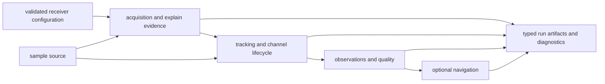
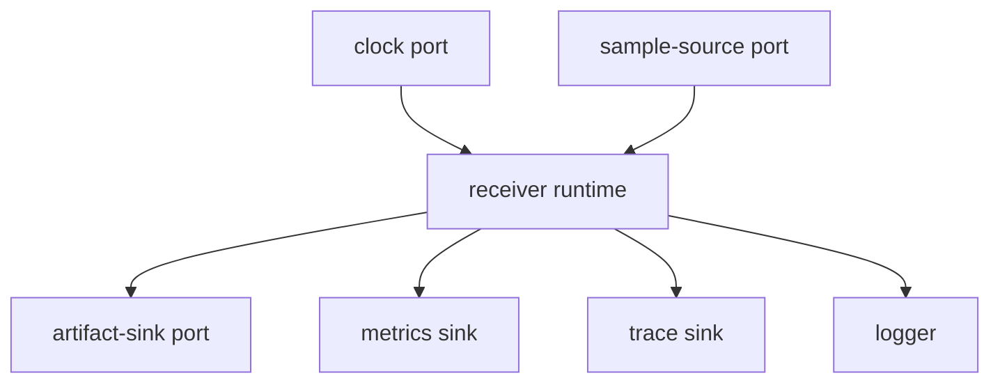

# Architecture

`bijux-gnss-receiver` owns the runtime that turns sample frames into
acquisition, tracking, observation, optional navigation, diagnostic, and
artifact evidence. It composes signal and navigation science without
reimplementing either domain.

## Runtime Dataflow

Each stage records accepted, degraded, deferred, or refused behavior rather than
leaving callers to infer state from a final success flag.

## Ownership Boundaries

| responsibility | owner |
| --- | --- |
| configuration, defaults, validation, runtime sinks, metrics, diagnostics, support, and composition | [receiver engine](../src/engine/mod.rs) |
| sample and in-memory input adapters | [input boundary](../src/io/mod.rs) |
| source, artifact-sink, and clock abstractions | [runtime ports](../src/ports/mod.rs) |
| acquisition search, assistance, component hypotheses, thresholds, and explain evidence | [acquisition stage](../src/pipeline/acquisition.rs) |
| channel lifecycle, correlation, lock, CN0, uncertainty, and transition evidence | [tracking stage](../src/pipeline/tracking.rs) |
| observation construction, residuals, quality, smoothing, and compatibility validation | [observation stage](../src/pipeline/observations.rs) |
| navigation invocation and receiver-owned filtering adapters | [navigation stage](../src/pipeline/navigation.rs) and [navigation filter](../src/pipeline/navigation_filter.rs) |
| in-memory execution results | [run artifact contract](../src/api.rs) and [observation artifact adapter](../src/artifacts.rs) |
| reference comparison, covariance realism, and validation reporting | [reference validation](../src/reference_validation.rs), [covariance realism](../src/covariance_realism.rs), and [validation reports](../src/validation_report.rs) |
| deterministic synthetic receiver scenarios | [simulation boundary](../src/sim/mod.rs) |
| deliberate downstream exports and receiver entrypoints | [curated receiver API](../src/api.rs) |

## Runtime Side Effects

Stage math must not open repository files, choose wall-clock time, or create
command output directly. Runtime effects pass through these explicit
boundaries.

## Dependency Direction

The receiver depends on core contracts, signal definitions and DSP, and
optional navigation science. Infrastructure and the command facade consume the
receiver API. Repository layout and command presentation must not flow back
into runtime stages.

## Receiver Invariants

- Configuration defaults and validation are explicit before samples are
  processed.
- Acquisition evidence identifies accepted, ambiguous, rejected, and deferred
  candidates.
- Tracking preserves channel state transitions, lock evidence, uncertainty, and
  continuity.
- Observations retain timing, quality, covariance, residual, and refusal
  context.
- Navigation remains optional and does not change ownership of earlier stages.
- Run artifacts describe in-memory behavior; infrastructure decides where they
  are persisted.

The [pipeline guide](PIPELINE.md), [runtime guide](RUNTIME.md), and
[artifact guide](ARTIFACTS.md) define these contracts in detail.

## Architectural Evidence

- [Acquisition truth-table coverage](../tests/integration_acquisition_truth_table.rs)
  protects candidate classification.
- [Tracking truth-table coverage](../tests/integration_tracking_truth_table.rs)
  protects channel evidence and lock state.
- [Observation truth-table coverage](../tests/integration_observations_truth_table.rs)
  protects measurement decisions.
- [Pipeline determinism](../tests/integration_pipeline_determinism.rs) protects
  repeatable runtime behavior.
- [Navigation refusal coverage](../tests/integration_navigation_impossible_geometry.rs)
  protects optional downstream claims.
- [Package guardrails](../tests/integration_guardrails.rs) protect dependency
  and feature boundaries.
