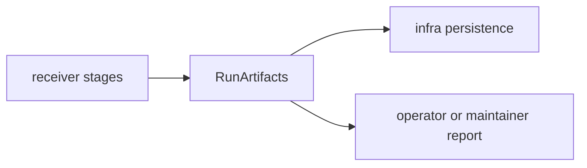

# Artifacts

`bijux-gnss-receiver` owns the in-memory result of a receiver run before
repository persistence. These artifacts describe what happened at runtime; they
do not decide where files live in the repository.

## Artifact Flow

## Receiver Artifact Families

| family | responsibility |
| --- | --- |
| input accounting | `processed_input_samples` and `processed_input_epochs` describe how much input was consumed. |
| acquisition evidence | Accepted acquisition results and explain artifacts. |
| tracking evidence | Tracking results, transition artifacts, and per-channel state reports. |
| observation evidence | Observation decisions, observation epochs, residuals, and measurement-quality reports. |
| support evidence | Signal support matrix captured at the receiver boundary. |
| navigation evidence | Navigation solution epochs and validation reports when the `nav` feature is enabled. |

## Boundary Rules

- Runtime artifacts may be rich and execution-oriented.
- Persisted manifest, report, and file naming policy belongs to
  `bijux-gnss-infra`.
- Reference validation belongs here only when it is receiver-boundary logic over
  receiver artifacts.
- Operator prose belongs to CLI reports; receiver artifacts should stay typed
  enough for machines and tests.

## Review Checks

- New artifact fields need a producer, consumer, and compatibility expectation.
- A field that will be persisted needs core or infra schema ownership reviewed.
- Do not replace typed refusal or diagnostic evidence with prose-only summaries.
