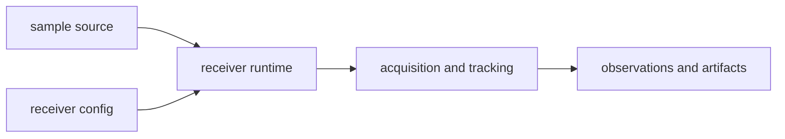

# Boundary

Owner: receiver runtime orchestration and stage execution

`bijux-gnss-receiver` owns live receiver behavior. It consumes signal contracts,
sample sources, and optional navigation helpers, then emits acquisition,
tracking, observation, diagnostic, and receiver-run evidence.

## Boundary Flow

## Owned Scope

`bijux-gnss-receiver` owns:

- receiver configuration and runtime state
- acquisition, tracking, observation, and navigation stage orchestration
- source/sink and clock boundary abstractions
- receiver-run artifact aggregation
- synthetic receiver execution and validation-report helpers exposed at the receiver boundary

## Out Of Scope

- repository run directories and manifest persistence
- operator command parsing, formatting, and workflow policy
- low-level signal-code generation or spectrum math already owned by `signal`
- standalone navigation science and file-format ownership already owned by `nav`

## Dependency Rule

This crate may depend downward on `core`, `signal`, and optional `nav`.
Higher-level crates should interact with it through public receiver APIs rather
than stage internals.

## Effect Model

This crate owns runtime-facing effects such as pulling samples from sources,
sending artifacts to sinks, and carrying runtime metrics and logging state.
Repository-facing persistence contracts still belong in `infra`.

## Review Checks

- Does new behavior change observable receiver evidence or only local
  implementation shape?
- Are lock state, code phase, carrier phase, CN0, and uncertainty changes
  visible in tests or artifacts?
- Does persisted layout remain delegated to `infra`?
