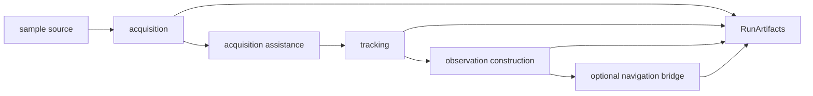

# Pipeline

`bijux-gnss-receiver` owns runtime composition across receiver stages. The
pipeline is where sample input becomes acquisition evidence, tracking state,
observation epochs, optional navigation handoff, and receiver-owned artifacts.

## Pipeline Flow

## Stage Families

| stage | owned behavior | handoff evidence |
| --- | --- | --- |
| acquisition | Searches signal hypotheses and reports accepted candidates with uncertainty. | `AcqResult`, acquisition explainability, assistance bounds. |
| acquisition assistance | Refines search windows and common oscillator estimates for follow-up attempts. | Resolved bounds and bias estimates. |
| tracking | Maintains code/carrier estimates, lock state, CN0, uncertainty, and channel lifecycle. | `TrackingResult`, transitions, channel state reports. |
| observations | Converts tracking state into measurement epochs and receiver-side quality evidence. | observation decisions, epochs, residuals, measurement quality. |
| navigation bridge | Optionally hands observation products to nav-owned runtimes when `nav` is enabled. | navigation epochs, validation reports, refusal evidence. |
| step reporting | Summarizes stage execution without replacing typed artifacts. | `StepReport`, `StepStats`. |

## Boundary Rules

- Stage ordering, handoff, and runtime state transitions belong here.
- Reusable signal math belongs in `bijux-gnss-signal`.
- Navigation-domain solver science belongs in `bijux-gnss-nav`.
- Repository manifests, reports, and persisted directories belong in
  `bijux-gnss-infra`.
- The receiver composes lower-level surfaces into runtime behavior; it does not
  take ownership of the lower-level science.

## Review Checks

- A new pipeline stage needs an input contract, output artifact or refusal path,
  and a clear owner.
- Handoff changes need tests that prove both success and degraded/refused cases.
- Stage reports must stay summaries; typed artifacts carry the durable evidence.
