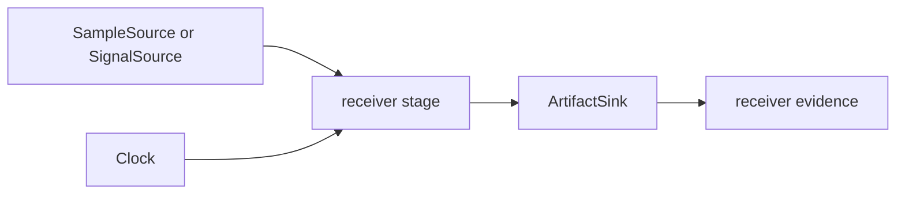

# Ports

`bijux-gnss-receiver` owns runtime I/O seams through explicit source, sink, and
clock boundaries. Ports let receiver stages consume samples, emit artifacts, and
observe time without hard-coding filesystem, wall-clock, or command policy into
stage logic.

## Port Flow

## Owned Ports

| port family | responsibility | reader concern |
| --- | --- | --- |
| sample input | `FileSamples`, `MemorySamples`, `SampleSource`, and `SignalSource` adapters feed sample frames to receiver stages. | Sample rate, end-of-stream behavior, frame length, and source-specific errors stay explicit. |
| artifact output | `ArtifactSink` isolates receiver artifact emission. | Stage code emits typed evidence without choosing repository layout. |
| clock access | `Clock` and `SystemClock` provide runtime time sources. | Tests can use deterministic time while production code can use a real clock. |
| runtime sinks | metrics, trace, and logging sinks live near runtime configuration. | Side effects remain visible at the receiver boundary. |

## Boundary Rules

- Ports are execution seams, not business logic. They must not decide
  acquisition thresholds, tracking status, or navigation validity.
- Repository persistence belongs to `bijux-gnss-infra`; a receiver sink may write
  artifacts but must not own run layout policy.
- CLI argument names and operator report wording belong to `bijux-gnss`.
- Signal sample representation belongs to `bijux-gnss-signal`; receiver ports
  decide how frames enter runtime.

## Review Checks

- New ports need deterministic test doubles or existing adapters that make
  integration tests practical.
- New port errors need enough context for a caller to distinguish bad input,
  missing source data, and failed side effects.
- Stage code that starts opening files or reading clocks directly is a boundary
  regression and belongs behind a port.
