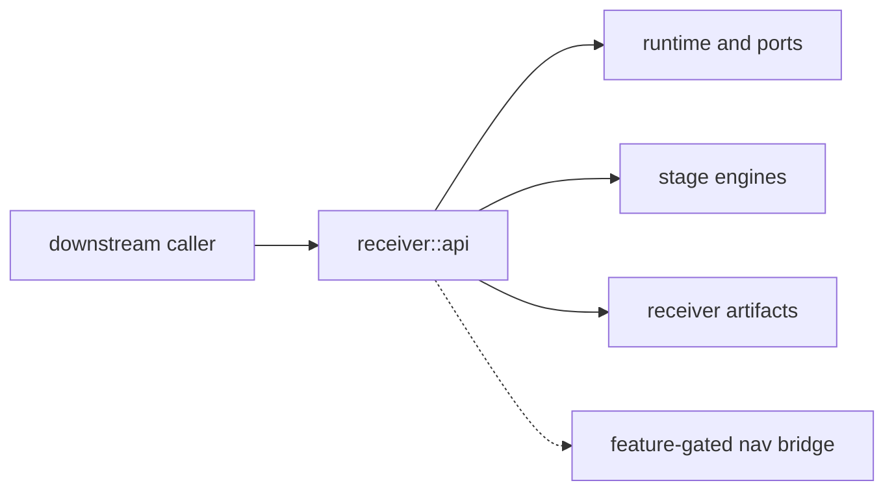

# Public API

`bijux-gnss-receiver` publishes a curated downstream surface through
`bijux_gnss_receiver::api`. The API exists for callers that need receiver
runtime behavior without importing private stage modules.

## API Flow

## API Families

| family | exported behavior |
| --- | --- |
| runtime and configuration | Receiver configuration, derived pipeline configuration, trace/metric sinks, clock, sample-source, and artifact-sink traits. |
| stage engines | Acquisition, tracking, observation construction, carrier-smoothed validation, and top-level receiver engine boundaries. |
| artifacts and validation | `RunArtifacts`, residual reports, measurement-quality reports, covariance realism, and validation reports. |
| feature-gated navigation | `Navigation`, `NavigationFilter`, nav runtime adapters, and selected nav-owned helper exports when `nav` is enabled. |
| convenience re-exports | Curated `core`, `signal`, and feature-gated `nav` imports for integration. |

## Boundary Rules

- Re-exports do not move ownership into the receiver crate.
- Stage internals remain private until callers need a durable runtime contract.
- Navigation exports must keep feature-gating visible.
- Public API additions need typed errors, diagnostics, or refusal evidence when
  execution can fail.

## Review Checks

- Does a new export describe receiver runtime behavior rather than signal or nav
  science?
- Can downstream users build a receiver flow without relying on private modules?
- Are feature-gated exports documented in both API docs and Rust attributes?
