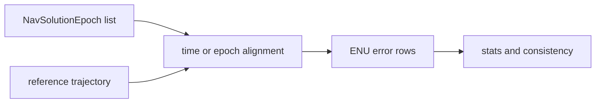

# Reference Validation

`bijux-gnss-receiver` owns runtime-side comparison between receiver-produced
navigation epochs and reference trajectories. This surface answers: given a set
of receiver outputs and a reference path, how far apart are they and does the
solution show obvious internal jumps?

## Owned Types

| type | reader meaning |
| --- | --- |
| `ReferenceAlign` | alignment policy: nearest reference epoch or linear interpolation |
| `ValidationReferenceEpoch` | reference position, optional ECEF, optional velocity, and optional receive-time tag |
| `ReferenceCompareStats` | RMS east, north, up, horizontal, vertical, and 3D error over matched epochs |
| `SolutionConsistencyReport` | countable anomalies such as position jumps, clock jumps, and PDOP spikes |

## Runtime Comparison Flow

## Contract Rules

- Reference epochs may provide ECEF directly; otherwise latitude, longitude, and
  altitude are converted before comparison.
- Time alignment is explicit. Use nearest-neighbor when preserving sampled truth
  matters; use linear interpolation when truth is continuous and bracketed.
- `reference_compare` emits CSV-like rows plus summary stats so tests and
  reports can inspect both individual epochs and aggregate behavior.
- Empty or unmatched inputs produce zero-count stats rather than fabricated
  accuracy claims.
- Consistency checks are sanity evidence, not a replacement for truth-guided
  accuracy budgets.

## Not Owned Here

- persisted artifact inspection belongs to `bijux-gnss-infra`
- solution estimation and navigation correction science belong to
  `bijux-gnss-nav`
- command-level validation workflow and report rendering belong to `bijux-gnss`
- independent reference models and shared truth fixtures belong to
  `bijux-gnss-testkit`

## Proof Surfaces

- `src/reference_validation.rs`
- receiver navigation accuracy integration tests
- synthetic validation reports under `src/sim/synthetic/`
