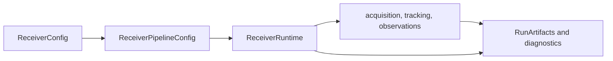

# Runtime

`bijux-gnss-receiver` owns top-level receiver runtime composition: validated
configuration, runtime side effects, stage orchestration, metrics, traces,
diagnostics, and receiver defaults. Runtime code is where acquisition,
tracking, observation generation, and optional navigation become one receiver
run.

## Runtime Flow

## Owned Responsibilities

| surface | responsibility |
| --- | --- |
| `src/engine/receiver_config.rs` | Accept on-disk and in-memory configuration, validate it, and derive runtime-ready pipeline settings. |
| `src/engine/runtime.rs` | Carry metrics, traces, logging, and run-context side effects without leaking them into pure stage math. |
| `src/engine/support_matrix.rs` | Describe signal-stage support from the receiver boundary. |
| `src/engine/receiver.rs` | Compose a full receiver run from configured stages and ports. |
| `src/pipeline/` | Own stage execution while preserving receiver-level diagnostics and artifacts. |

## Runtime Invariants

- Defaults must be explicit and testable. A caller needs to know which settings
  were chosen when a config omits a field.
- Runtime side effects must pass through runtime or port abstractions, not hidden
  filesystem or clock calls inside stage logic.
- Diagnostics must preserve enough context to explain refusal, degraded lock,
  missing support, or invalid configuration.
- Navigation execution remains optional and feature-gated; receiver runtime may
  bridge to navigation but does not own solver science.

## Not Owned Here

- Signal-code generation, front-end formulas, and reusable DSP primitives belong
  to `bijux-gnss-signal`.
- Navigation correction and estimator behavior belongs to `bijux-gnss-nav`.
- Repository run-directory layout and dataset registry belong to
  `bijux-gnss-infra`.
- Operator-facing command wording belongs to `bijux-gnss`.

## Review Checks

- Any new runtime option needs a documented default, validation path, and report
  or diagnostic impact.
- Any new side effect needs a port, runtime sink, or explicit artifact owner.
- Receiver support changes need tests that prove unsupported cases refuse
  clearly instead of silently skipping stages.
