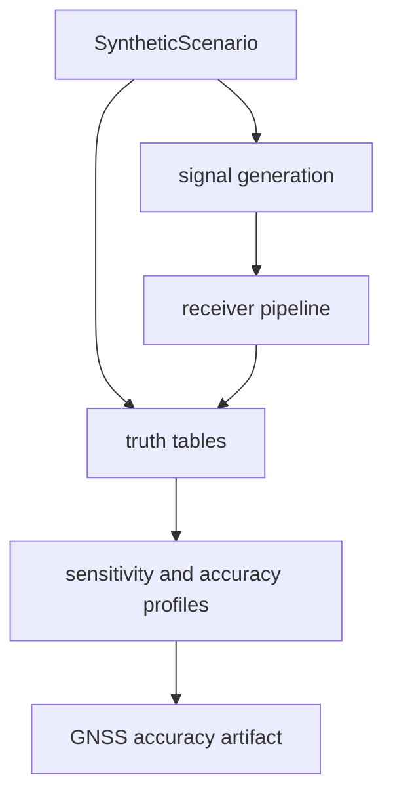

# Simulation

`bijux-gnss-receiver` owns receiver-boundary simulation helpers used by tests,
demos, and validation workflows. The simulation surface exists to exercise the
receiver as a runtime system: sample generation, injected truth, acquisition
truth, tracking truth, observation truth, PVT profiles, and run-level accuracy
artifacts.

It is not a generic fixture bucket. Shared independent truth models belong in
`bijux-gnss-testkit`; persisted run layout belongs in `bijux-gnss-infra`.

## Simulation Flow

## Owned Families

- synthetic scenario records and deterministic signal generation
- C/N0, Doppler, code-phase, carrier, fade, oscillator, and multipath
  injections used at the receiver boundary
- acquisition operating-envelope, uncertainty, detection-rate, and interference
  reports
- tracking truth tables, noise characterization, sensitivity, and numerical
  stability reports
- observation truth tables and validation reports for pseudorange, carrier
  phase, Doppler, and C/N0
- PVT truth coverage, accuracy profiles, and run-level GNSS accuracy artifacts

## Contract Rules

- Scenario IDs are stable evidence keys. Do not encode execution order or local
  run history into them.
- Synthetic truth must remain explicit about injected signal identity,
  receiver-clock behavior, geometry, ionosphere, troposphere, and navigation
  data.
- A missing truth row should produce a coverage issue, not a silent pass.
- Receiver-boundary simulation may use production receiver code; independent
  reference science used to challenge production code belongs in testkit.
- Reports should carry units in field names whenever the value is not
  dimensionless.

## Not Owned Here

- production signal catalog and DSP primitives belong to `bijux-gnss-signal`
- navigation estimators and correction science belong to `bijux-gnss-nav`
- repository sidecars, manifests, and artifact paths belong to
  `bijux-gnss-infra`
- shared cross-crate fixtures and independent models belong to
  `bijux-gnss-testkit`

## Proof Surfaces

- `src/sim/synthetic.rs`
- included modules under `src/sim/synthetic/`
- receiver integration tests named `integration_*synthetic*`,
  `integration_*truth*`, and `integration_*accuracy*`
