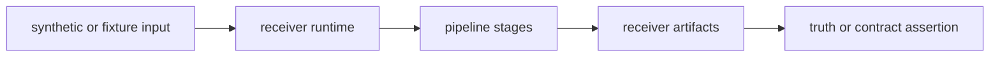

# Tests

`bijux-gnss-receiver` has the largest execution-oriented test surface in the
workspace. Tests here prove runtime behavior across acquisition, tracking,
observation generation, optional navigation handoff, receiver artifacts, and
receiver-side validation.

## Test Flow



## Major Test Families

| family | protects |
| --- | --- |
| acquisition | Accuracy, interference, explainability, uncertainty, support, and truth-table behavior. |
| tracking | Lock, loop dynamics, continuity, fades, handoff, uncertainty, and truth-table behavior. |
| observations | Measurement quality, smoothing, residuals, covariance, cycle-slip and degraded-state handling. |
| navigation bridge | Navigation accuracy, integrity, protection levels, validation reports, and refused claims. |
| RTK and downstream evidence | Differencing, ambiguity fixing, baseline evidence, and receiver-produced artifacts. |
| capability and determinism | Support matrix, boundary policy, deterministic outputs, and shared support fixtures. |

## Contract Rules

- Receiver tests should prove observable runtime behavior, not private helper
  implementation.
- Slow proof tests belong in the governed slow roster rather than the fast lane.
- Synthetic and reference-backed validation should preserve independent truth
  where practical.
- Artifact tests should assert typed evidence and refusal paths, not only that a
  command did not panic.

## Verification

Useful narrow commands from the repository root:

```sh
cargo test -p bijux-gnss-receiver --test integration_basic
cargo test -p bijux-gnss-receiver --test integration_receiver_support_matrix_inventory
cargo test -p bijux-gnss-receiver --test integration_navigation_pvt_accuracy_budget
```

Use repository test-lane docs when a receiver test is too slow for the fast
lane.
