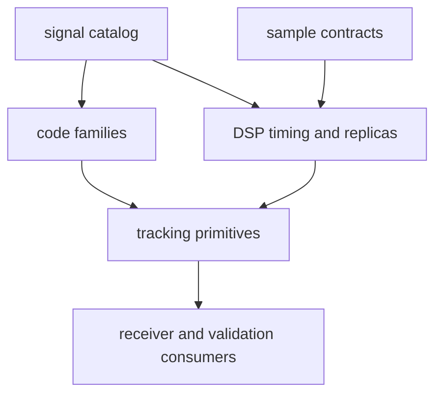

# bijux-gnss-signal API

`bijux-gnss-signal` exposes reusable signal definitions and DSP primitives. Its
API is meant for callers that need signal identity, spreading-code generation,
raw-IQ metadata, sample conversion, carrier/code timing, spectra, front-end
quality, replicas, or tracking-loop math without pulling in receiver runtime
policy.

## API Map

| family | representative items | contract owned here |
| --- | --- | --- |
| catalog | `signal_registry`, `resolved_signal_registry_entry`, carrier/wavelength helpers, ionosphere scaling helpers | Canonical signal identities, carriers, wavelengths, components, and default acquisition targets. |
| spreading codes | GPS L1 C/A, GPS L2C, GPS L5, Galileo E1/E5, BeiDou B1I/B2I, GLONASS L1 helpers | Deterministic code and secondary-code generation with constellation-specific constants. |
| sample contracts | `SamplesFrame`, `RawIqMetadata`, `IqSampleFormat`, `IqQuantization`, sample conversion and quantization helpers | Represent raw and normalized I/Q samples without receiver scheduling policy. |
| DSP timing | `code_sample_position_at_index`, `advance_code_phase_*`, wrapped code-phase helpers | Keep chunked code generation and tracking math stable across sample boundaries. |
| front-end and quality | FIR response helpers, IQ metrics, noise-floor estimation, DC removal | Measure and model reusable front-end behavior. |
| replicas and spectra | replica code models, carrier trajectories, modulation requests, PSD summaries | Generate and inspect synthetic or local signal references. |
| tracking primitives | discriminators, loop coefficients, CN0 estimation, lock thresholds, uncertainty helpers | Provide reusable math used by receiver tracking without owning channel state. |
| traits | `SignalSource`, `SampleSource`, `Correlator`, `SampleSink` | Define lightweight signal-adjacent seams for callers and tests. |

## Boundary Rules

- This crate owns reusable signal math and representation, not receiver channel
  orchestration.
- Code and carrier helpers must be stable under chunked processing and absolute
  sample-index use.
- Raw-IQ metadata must describe samples honestly; it must not imply receiver
  performance claims.
- Tracking-loop primitives may compute updates, but lock lifecycle and channel
  evidence belong to `bijux-gnss-receiver`.

## Reader Guidance

Use the [signal catalog guide](docs/CATALOG.md) before adding a signal, then
follow the [code family guide](docs/CODE_FAMILIES.md), [DSP guide](docs/DSP.md),
[raw IQ guide](docs/RAW_IQ.md), and [sample guide](docs/SAMPLES.md) for
the owned contract being changed.

## Review Checks

- New public signal constants need source-system meaning and test coverage.
- New sample helpers need unit and quantization behavior documented.
- New tracking primitives need deterministic tests across phase wrapping,
  chunking, and boundary conditions.
