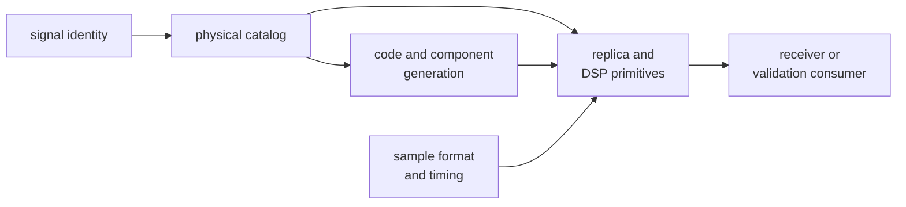

# bijux-gnss-signal

[](https://crates.io/crates/bijux-gnss-signal)
[](https://github.com/bijux/bijux-gnss/blob/main/LICENSE)
[](https://github.com/bijux/bijux-gnss)
[](https://crates.io/crates/bijux-gnss-signal)
[](https://github.com/bijux/bijux-gnss/pkgs/container/bijux-gnss%2Fbijux-gnss-signal)
[](https://docs.rs/bijux-gnss-signal/latest/bijux_gnss_signal/)
[](https://github.com/bijux/bijux-gnss/tree/main/docs/bijux-gnss-signal)

`bijux-gnss-signal` turns a GNSS signal identity into reusable physical and
digital behavior. It provides the catalog, primary and secondary codes, raw-IQ
vocabulary, sample conversion, replicas, spectra, NCOs, tracking primitives,
and source/sink/correlator traits used by receiver implementations.

This crate answers questions that remain true outside one receiver run. Search
windows, channel state, lock policy, persisted datasets, and position
estimation have stronger owners elsewhere.

## Begin With A Signal Definition

```rust
use bijux_gnss_signal::api::{
    signal_spec_gps_l1_ca, signal_wavelength_m,
};

let gps_l1_ca = signal_spec_gps_l1_ca();
let wavelength = signal_wavelength_m(gps_l1_ca);
```

The catalog is the common source for carrier frequency, code rate, code length,
component roles, secondary-code metadata, and wavelength conversion. A
receiver configuration should reference that meaning rather than copy it.

All supported downstream imports are exposed through
`bijux_gnss_signal::api`. The crate currently has no optional Cargo features;
its package surface is selected through the API rather than compile-time
feature combinations. The first registry release is still being prepared.

## Choose The Layer That Owns Your Question

| Question | Read next |
| --- | --- |
| What does this signal identity mean physically? | [Signal catalog](docs/CATALOG.md) |
| How is its primary, secondary, pilot, or data code generated? | [Code-family behavior](docs/CODE_FAMILIES.md) |
| How are sample index, phase, replica, NCO, spectrum, or loop math defined? | [DSP conventions](docs/DSP.md) |
| What does an encoded IQ sample or quantization profile mean? | [Raw-IQ contract](docs/RAW_IQ.md) and [sample conversion](docs/SAMPLES.md) |
| Which source, sink, and correlator interfaces may implementations provide? | [Public trait contract](docs/TRAITS.md) |
| Can two observations participate in a signal-layer combination? | [Compatibility validation](docs/VALIDATION.md) |



The arrows describe reusable meaning, not receiver support. A registered signal
definition proves that catalog data exists. It does not by itself prove that
acquisition, tracking, observation generation, or navigation is supported for
that signal. Consult the receiver support evidence before making an end-to-end
claim.

## Preserve The Physical Contract

A signal-layer change must keep these facts explicit:

- constellation, band, code, data/pilot role, and default component;
- carrier frequency, code rate, code length, and secondary-code period;
- sample rate, intermediate frequency, byte offset, quantization, and capture
  time for raw IQ;
- phase origin, wrapping, units, and normalization for DSP output;
- behavior at chunk boundaries and large absolute sample indices;
- unsupported or misaligned combinations as typed refusals.

Raw-IQ metadata deliberately does not own dataset identity or provenance.
Infrastructure resolves sidecars and locations; signal defines what the sample
fields mean. Likewise, DSP primitives do not decide channel scheduling or lock
thresholds. The receiver composes them into runtime behavior.

## Use The Public Traits Deliberately

The API exports four integration traits:

- `SignalSource` produces typed signal blocks;
- `SampleSource` reads complex samples;
- `Correlator` maps samples and replicas to correlation results;
- `SampleSink` receives sample blocks.

These interfaces isolate reusable signal mechanics. They are not an invitation
to move run layout, device lifecycle, telemetry policy, or receiver state into
this package. See the [public API guide](docs/PUBLIC_API.md) for admitted
exports and the [architecture guide](docs/ARCHITECTURE.md) for dependency
direction.

## Evaluate A Change By Its Claim

Reference-vector tests protect code families, property tests protect indexing
and conversion invariants, and integration tests protect catalog and spectrum
behavior. No single test family proves complete receiver support. Use the
[test evidence guide](docs/TESTS.md) to select the proof that matches the
changed physical claim.

Compatibility and support changes belong in the
[package release history](CHANGELOG.md). The
[signal release guide](../../docs/bijux-gnss-signal/operations/release-and-versioning.md)
defines the evidence expected before publication.
