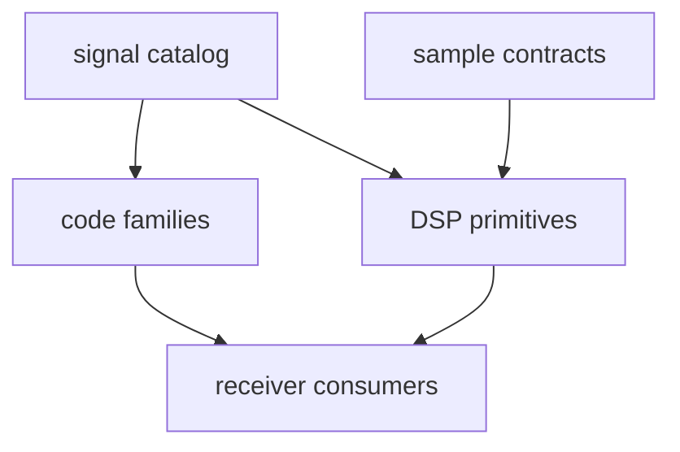

# bijux-gnss-signal

[](https://crates.io/crates/bijux-gnss-signal)
[](https://github.com/bijux/bijux-telecom/blob/main/LICENSE)
[](https://github.com/bijux/bijux-telecom)
[](https://crates.io/crates/bijux-gnss-signal)
[](https://github.com/bijux/bijux-telecom/pkgs/container/bijux-telecom%2Fbijux-gnss-signal)
[](https://docs.rs/bijux-gnss-signal/latest/bijux_gnss_signal/)
[](https://github.com/bijux/bijux-telecom/tree/main/docs/06-bijux-gnss-signal)

`bijux-gnss-signal` owns reusable GNSS signal definitions and DSP primitives:
signal catalogs, spreading codes, secondary codes, raw-IQ metadata,
sample conversion, NCOs, replicas, spectra, front-end helpers, and tracking-loop
building blocks.

Use this crate for reusable signal meaning that remains valid outside one
receiver run. Receiver scheduling, persisted run layout, navigation estimation,
and operator command behavior belong to higher crates.

## Availability

The first registry release has not been published. In this workspace, build or
test the package directly:

```sh
cargo test -p bijux-gnss-signal
```

After publication, add it with `cargo add bijux-gnss-signal`. The Cargo package
name is `bijux-gnss-signal`; its Rust import name is `bijux_gnss_signal`. All
public packages in this repository share one release version.

## Choose the Signal Contract

| question | go next |
| --- | --- |
| Which signal identity, component, carrier, code rate, or wavelength is registered? | [signal catalog](docs/CATALOG.md) |
| Which primary or secondary code behavior is implemented? | [code-family guide](docs/CODE_FAMILIES.md) |
| Which DSP primitive owns timing, NCO, replica, spectrum, or tracking math? | [DSP guide](docs/DSP.md) |
| Which raw sample or metadata contract applies? | [Raw IQ guide](docs/RAW_IQ.md), [Sample guide](docs/SAMPLES.md) |
| Which source, sink, or correlator interface is public? | [trait guide](docs/TRAITS.md) |
| What compatibility changed? | [package release history](CHANGELOG.md) |

## Owned Boundary

- signal catalogs and physical wavelength helpers
- spreading-code and secondary-code generation across supported constellations
- front-end, replica, spectrum, timing, NCO, and tracking-loop primitives
- raw-IQ metadata and sample-conversion contracts
- signal-layer observation compatibility validation

This crate does not own receiver orchestration, persisted run layout, navigation
estimation, or operator command behavior.



## Behavioral Invariants

- Signal identity determines physical metadata; receiver configuration must not
  redefine carrier, code-rate, wavelength, or component roles.
- Code generation and replica sampling remain deterministic across chunk
  boundaries and long-running sample indices.
- Raw-IQ formats preserve explicit sample rate, intermediate frequency,
  quantization, offset, and timestamp meaning.
- DSP outputs state units, normalization, phase origin, and wrapping behavior.
- Observation compatibility reports refusal or misalignment instead of silently
  accepting an unsupported signal pair.

The [signal release guide](../../docs/06-bijux-gnss-signal/operations/release-and-versioning.md)
defines the evidence required when one of these behaviors changes.

## Implementation Ownership

- The [signal catalog](src/catalog.rs) owns physical metadata, lookup, default
  acquisition selection, and wavelength helpers.
- The [code families](src/codes/mod.rs) own constellation-specific primary,
  secondary, and multiplexed code behavior.
- The [DSP boundary](src/dsp/mod.rs) owns runtime-neutral processing
  primitives.
- The [observation compatibility layer](src/obs_validation.rs) owns
  dual-frequency and inter-frequency checks.
- The [raw-IQ metadata](src/raw_iq.rs) and
  [sample conversion](src/samples.rs) implementations own capture vocabulary
  and numeric conversion.
- The [public API](src/api.rs) owns deliberate exports and source, sink, and
  correlator traits.

For package boundaries and proof, continue with the
[architecture guide](docs/ARCHITECTURE.md), [contract guide](docs/CONTRACTS.md),
[validation guide](docs/VALIDATION.md), and [test guide](docs/TESTS.md).

## Verification Focus

Use signal tests that prove the changed primitive or catalog entry:

```sh
cargo test -p bijux-gnss-signal --test integration_signal_component_registry
cargo test -p bijux-gnss-signal --test integration_signal_spectrum_cboc
cargo test -p bijux-gnss-signal --test prop_obs_epoch_validation
```

Repository-wide lanes and package routing are documented in the
[workspace README](../../README.md).
