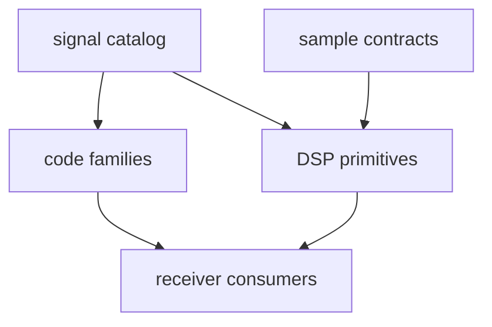

# bijux-gnss-signal

`bijux-gnss-signal` owns reusable GNSS signal definitions and DSP primitives:
signal catalogs, spreading codes, secondary codes, raw-IQ metadata,
sample conversion, NCOs, replicas, spectra, front-end helpers, and tracking-loop
building blocks.

Start here when a value or algorithm is reusable signal meaning. Do not start
here for receiver scheduling, persisted run layout, navigation estimation, or
operator command behavior.

## Reader Route

| question | go next |
| --- | --- |
| Which signal identity or wavelength is registered? | [Signal catalog guide](docs/CATALOG.md), `src/catalog.rs` |
| Which code family or secondary code is implemented? | [Code family guide](docs/CODE_FAMILIES.md), `src/codes/` |
| Which DSP primitive owns timing, NCO, replica, or spectrum behavior? | [DSP guide](docs/DSP.md), `src/dsp/` |
| Which raw sample or metadata contract applies? | [Raw IQ guide](docs/RAW_IQ.md), [Sample guide](docs/SAMPLES.md) |
| What changed in this package? | [Package changelog](CHANGELOG.md) |

## Owned Boundary

- signal catalogs and physical wavelength helpers
- spreading-code and secondary-code generation across supported constellations
- front-end, replica, spectrum, timing, NCO, and tracking-loop primitives
- raw-IQ metadata and sample-conversion contracts
- signal-layer observation compatibility validation

This crate does not own receiver orchestration, persisted run layout, navigation
estimation, or operator command behavior.



## Source Map

- `src/catalog.rs` owns signal lookup and wavelength helpers.
- `src/codes/` owns constellation-specific code families.
- `src/dsp/` owns reusable signal-processing primitives.
- `src/obs_validation.rs` owns signal-level observation compatibility checks.
- `src/raw_iq.rs` and `src/samples.rs` own raw-sample contracts and
  conversions.

## Documentation Map

- [Architecture guide](docs/ARCHITECTURE.md)
- [Boundary guide](docs/BOUNDARY.md)
- [Signal catalog guide](docs/CATALOG.md)
- [Code family guide](docs/CODE_FAMILIES.md)
- [Contract guide](docs/CONTRACTS.md)
- [DSP guide](docs/DSP.md)
- [Raw IQ guide](docs/RAW_IQ.md)
- [Sample guide](docs/SAMPLES.md)
- [Trait guide](docs/TRAITS.md)
- [Public API](docs/PUBLIC_API.md)
- [Test guide](docs/TESTS.md)
- [Validation guide](docs/VALIDATION.md)

## Verification Focus

Use signal tests that prove the changed primitive or catalog entry:

```sh
cargo test -p bijux-gnss-signal --test integration_signal_component_registry
cargo test -p bijux-gnss-signal --test integration_signal_spectrum_cboc
cargo test -p bijux-gnss-signal --test prop_obs_epoch_validation
```

Repository-wide lanes and package routing are documented in the
[workspace README](../../README.md).
