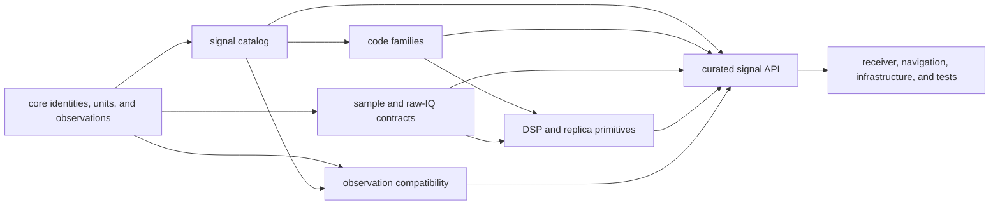
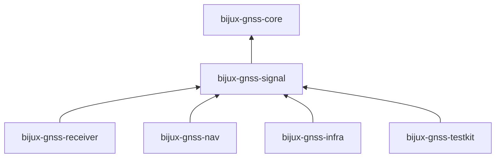
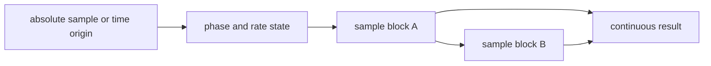
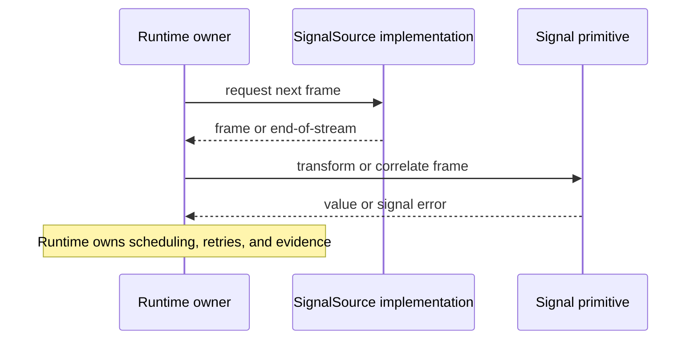

# Signal Architecture

`bijux-gnss-signal` owns reusable facts and computations between foundational
GNSS types and receiver execution. It answers what a signal means and how its
samples behave. It does not decide which channel runs, when lock is declared, or
where a capture is stored.

## Architectural Flow

The [curated signal API](../src/api.rs) is the only supported downstream
surface. Internal modules own implementation detail; consumers should not infer
stability from source layout.

## Responsibility Boundaries

| region | owns | rejects |
| --- | --- | --- |
| [signal catalog](CATALOG.md) | signal specifications, carrier and wavelength relationships, registry lookup, default acquisition choices, and shared-path scaling | channel selection policy tied to a receiver session |
| [code families](CODE_FAMILIES.md) | deterministic primary, secondary, data-symbol, assignment, and sampling behavior for supported signals | acquisition search strategy and tracking lifecycle |
| [raw-IQ contract](RAW_IQ.md) and [sample conversion](SAMPLES.md) | capture metadata, quantization meaning, in-memory conversion, and storage encoding | opening capture files or choosing repository layouts |
| [DSP primitives](DSP.md) | front-end response, code timing, NCOs, replicas, spectra, correlation, loop updates, quality metrics, and uncertainty calculations | channel scheduling, lock-state policy, and receiver artifacts |
| [observation validation](VALIDATION.md) | signal-pair compatibility and inter-frequency alignment evidence | navigation acceptance policy or position estimation |
| [streaming traits](TRAITS.md) | minimal caller-facing source, sink, and correlator seams | ownership of I/O implementations or their lifecycle |

The distinction between computation and orchestration is semantic, not based on
whether a type contains state. An NCO can preserve phase and a front-end filter
can preserve delay-line state while remaining a signal primitive. A component
becomes receiver-owned when it selects work, coordinates channels, interprets
session history, or commits operational evidence.

## Dependency Direction

The signal crate depends on core contracts and general numerical libraries. It
must not depend on receiver, navigation, infrastructure, or test-support code.
If a new helper needs one of those packages, its ownership is almost certainly
above the signal layer.

## Timing And Continuity

Signal computations are often evaluated in blocks while their physical model is
continuous. APIs that advance code or carrier state must therefore expose enough
context to produce the same result regardless of chunking.

The governing invariants are:

- sample rate, code rate, carrier frequency, phase origin, and units are
  explicit;
- code and carrier phase wrap according to the documented domain;
- sampling one continuous interval in adjacent blocks agrees with sampling it
  as one block within numerical tolerance;
- constellation-specific behavior, including GLONASS frequency channels and
  data/pilot components, is not erased by generic helpers;
- invalid rates, phases, definitions, and code assignments fail through
  `SignalError` rather than producing plausible-looking samples.

## Public Traits And Effect Ownership

`SignalSource`, `SampleSource`, `SampleSink`, and `Correlator` are dependency
inversion seams. The trait definitions describe what a signal consumer needs;
the implementing crate owns filesystem, device, network, or buffering effects.

Adding a method to one of these traits raises the integration burden for every
implementation. Prefer a free computational function unless the operation
requires polymorphic source or sink behavior.

## Placing New Behavior

Use these ownership tests:

1. If the behavior defines constellation, signal, code, phase, sample, or
   spectral meaning independent of one run, it belongs here.
2. If it schedules acquisition or tracking, combines channel history, or makes a
   receiver-state decision, place it in `bijux-gnss-receiver`.
3. If it interprets observations for orbit, atmosphere, PPP, RTK, or a position
   solution, place it in `bijux-gnss-nav`.
4. If it opens captures, persists datasets, or owns repository evidence, place
   it in `bijux-gnss-infra`.
5. If it exists only to produce independent expected values, place it in
   `bijux-gnss-testkit`.

Before exposing a new signal API, define units and validity, prove deterministic
behavior, cover chunk boundaries when time evolves, and confirm that the
operation remains useful without receiver runtime state.

See the [boundary guide](BOUNDARY.md), [contract guide](CONTRACTS.md), and
[test guide](TESTS.md) for the detailed review surfaces.
