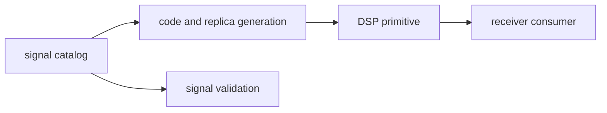

# Boundary

Owner: reusable GNSS signal definitions and DSP primitives

`bijux-gnss-signal` owns reusable signal facts and computations before a
receiver turns them into runtime state. It should remain usable by acquisition,
tracking, validation, and test code without learning about repository runs.

## Boundary Flow

## Owned Scope

`bijux-gnss-signal` owns:

- signal catalogs and wavelength helpers
- spreading-code and secondary-code generation
- local-code sampling and code-phase math
- replica generation and carrier/code wipeoff helpers
- front-end quality and spectrum helpers
- tracking-loop primitives and related uncertainty helpers
- raw-IQ metadata and sample conversion utilities
- signal-layer observation compatibility checks

## Out Of Scope

- filesystem-backed sample ingestion
- receiver scheduling, channel orchestration, or artifact persistence
- orbit, atmospheric, PPP, or RTK estimation
- CLI commands or maintainer workflows

## Allowed Dependencies

- `bijux-gnss-core` for foundational contracts
- numeric and FFT libraries needed for DSP primitives

## Effect Model

This crate should be computationally pure from a product perspective. It may
transform samples and analyze in-memory data, but it should not decide run
layouts, datasets, or repository workflows.

## Change Standard

Signal definitions and DSP helpers are reused across the workspace. Changes
here must preserve clear ownership and deterministic behavior, especially when
they affect code generation, timing, or physical interpretation.

## Review Checks

- Does the change describe signal meaning or receiver runtime behavior?
- Are units, chips, samples, carrier, and spectrum assumptions explicit?
- Can downstream receiver code consume the result without hidden repository
  state?
