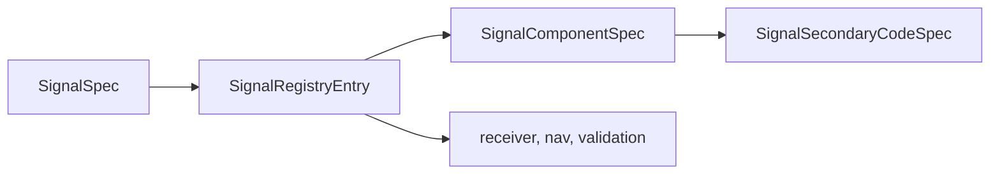

# Catalog

`bijux-gnss-signal` owns the canonical registry of supported signal definitions
and physical lookup helpers. Readers should use this file when they need to know
whether a signal identity, carrier, code rate, component role, secondary code,
or wavelength is a reusable signal-layer fact.

## Registry Shape

## Owned Facts

- signal-spec constructors by constellation, band, and code
- carrier frequency, code rate, and primary-code length
- GLONASS L1 FDMA carrier lookup from frequency channel
- component role metadata for data, pilot, and combined signals
- secondary-code timing where the signal family exposes one
- cycle-to-meter and meter-to-cycle helpers via wavelength lookup
- default acquisition signal selection helpers used by higher layers

## Reader Rules

- If a value is a physical signal fact, add or change it here before receiver or
  navigation code consumes it.
- If a signal has data and pilot components, document which component is the
  default acquisition or tracking surface and why.
- If a helper needs receiver state to choose behavior, it does not belong in the
  catalog.
- If a helper needs navigation solution state, it belongs in navigation code,
  not in the signal registry.

## Not Owned Here

- acquisition search windows and channel scheduling belong to
  `bijux-gnss-receiver`
- navigation-state inference belongs to `bijux-gnss-nav`
- dataset or sidecar registration belongs to `bijux-gnss-infra`
- operator-facing signal selection belongs to the CLI facade

## Proof Surfaces

- `src/catalog.rs`
- `tests/integration_signal_component_registry.rs`
- `tests/integration_signal_wavelengths.rs`
- signal-family reference tests under `tests/integration_*_reference.rs`
