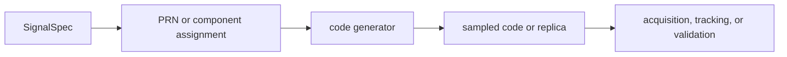

# Code Families

`bijux-gnss-signal` owns canonical spreading-code behavior for supported GNSS
signal families. Acquisition, tracking, validation, and synthetic generation
must not each invent their own near-copy of a code generator.

## Code Family Flow

## Covered Families

| family | owned behavior |
| --- | --- |
| GPS L1 C/A | PRN assignments, chip generation, autocorrelation and cross-correlation helpers. |
| GPS L2C and L5 | Component assignment, primary code generation, secondary-code timing, and sampled helpers. |
| Galileo E1 and E5 | BOC/CBOC behavior, pilot/data components, primary and secondary code helpers. |
| BeiDou B1I, B2I, and D1 helpers | Assignment tables, primary chips, and D1 secondary-code timing. |
| GLONASS L1 | ST code generation and string-symbol helpers. |

## Boundary Rules

- Family-specific assignments, constants, primary-code generation, and
  secondary-code helpers belong here.
- Receiver-specific search strategy and lock lifecycle belong to
  `bijux-gnss-receiver`.
- Navigation-message decoding belongs to `bijux-gnss-nav`.
- Reference fixtures may live in tests, but production code behavior remains
  owned here.

## Review Checks

- New code families need source references, PRN/component coverage, and
  deterministic tests.
- Sampled helpers need chip-rate, epoch, and wrapping behavior documented.
- Any change to chip polarity or secondary-code timing needs acquisition and
  tracking impact reviewed.
