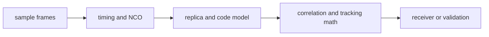

# DSP

`bijux-gnss-signal` owns reusable DSP primitives below receiver orchestration.
These helpers transform samples, phases, correlations, spectra, and signal
models without deciding channel scheduling, runtime state, or artifact layout.

## DSP Flow

## DSP Families

| family | responsibility |
| --- | --- |
| `front_end` | FIR front-end response and transfer-function helpers. |
| `local_code`, `sample_timing`, `signal` | Code-phase, sample-index, wrapping, and timing math. |
| `nco` | Oscillator state and phase progression. |
| `replica` | Synthetic carrier/code generation, modulation, trajectories, and wipeoff helpers. |
| `quality` and `spectrum` | Front-end quality metrics and power spectral density analysis. |
| `tracking` | Reusable loop, discriminator, CN0, uncertainty, and lock-threshold primitives. |

## Boundary Rules

- DSP helpers may transform samples and correlations, but must stay
  runtime-neutral.
- Receiver sequencing, channel scheduling, lock lifecycle, and artifact
  persistence belong in `bijux-gnss-receiver`.
- Navigation-state interpretation belongs in `bijux-gnss-nav`.
- Long-duration continuity and deterministic wrapping are part of the public
  contract for timing-sensitive helpers.

## Review Checks

- Changes to phase, frequency, sample-index, or wrapping behavior need boundary
  and long-duration tests.
- Tracking primitives should expose math and thresholds, not receiver lifecycle
  decisions.
- Spectrum and quality helpers must document units and normalization assumptions.
