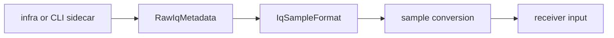

# Raw IQ

`bijux-gnss-signal` owns the typed vocabulary for raw-IQ metadata. The crate
does not find files, trust sidecars, or decide where a capture lives; it defines
the sample-format and quantization terms that higher layers must use
consistently.

## Owned Types

| type | reader meaning |
| --- | --- |
| `IqSampleFormat` | encoded on-disk complex sample container: signed 8-bit IQ, signed 16-bit little-endian IQ, or complex float32 little-endian IQ |
| `IqQuantization` | controlled storage quantization profile used by synthetic export and quantization-loss workflows |
| `RawIqMetadata` | explicit ingest metadata: format, sample rate, IF, capture start, optional byte offset, quantization depth, and notes |

## Flow

## Contract Rules

- `sample_rate_hz` and `intermediate_freq_hz` are physical capture facts. Do
  not infer them from receiver configuration.
- `offset_bytes` is only the byte position of the first I/Q pair. It is not a
  dataset identity or provenance field.
- `IqQuantization::sample_format()` records the container required to store a
  profile; it is not a claim that the original capture had that precision.
- `quantization_bits` in metadata is optional because older or external
  captures may know the container but not the effective quantizer.
- Raw-IQ metadata must remain serializable because infra, CLI, receiver, and
  synthetic workflows exchange it through sidecars and artifacts.

## Not Owned Here

- dataset registration and sidecar lookup belong to `bijux-gnss-infra`
- command arguments and operator reports belong to `bijux-gnss`
- capture decoding into receiver frames belongs to receiver or infrastructure
  ingestion paths
- truth JSON and synthetic scenario policy belong to receiver simulation docs

## Proof Surfaces

- `src/raw_iq.rs`
- `src/samples.rs`
- `tests/integration_raw_iq_metadata.rs`
- `tests/integration_iq_sample_conversion.rs`
