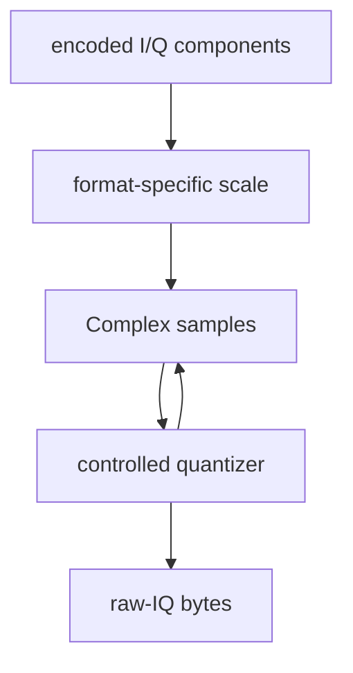

# Samples

`bijux-gnss-signal` owns conversion between encoded I/Q containers and
normalized complex samples. The point of this surface is not convenience; it is
to keep every crate using the same scaling and quantization semantics.

## Reader Route

| question | owned surface |
| --- | --- |
| How do signed 8-bit pairs become complex samples? | `iq_i8_to_samples`, `I8_SCALE` |
| How do signed 16-bit pairs become complex samples? | `iq_i16_to_samples`, `I16_SCALE` |
| How do float32 pairs pass through? | `iq_f32_to_samples` |
| How does a synthetic capture get stored? | `encode_quantized_samples` |
| What does the receiver actually see after storage quantization? | `quantize_samples_for_storage` |

## Conversion Model

## Contract Rules

- Input slices are interpreted as interleaved I, Q, I, Q components.
- Trailing odd components are ignored by `chunks_exact`; callers that require a
  hard error must validate length before calling the conversion helper.
- Signed 8-bit samples scale by `1 / 128`; signed 16-bit samples scale by
  `1 / 32768`.
- Float32 samples are already normalized and are not rescaled.
- Non-finite values passed into quantized integer storage are converted through
  the quantizer path, which treats invalid numeric inputs as zero.
- The storage encoder returns bytes. The receiver-visible quantization helper
  returns complex samples after the same storage profile has been applied.

## Not Owned Here

- file reading, byte-order discovery, and dataset provenance belong outside the
  signal crate
- sample scheduling, coherent integration, and channel state belong to receiver
  stages
- navigation interpretation of observations belongs to `bijux-gnss-nav`

## Proof Surfaces

- `src/samples.rs`
- `src/raw_iq.rs`
- `tests/integration_iq_sample_conversion.rs`
- `tests/integration_raw_iq_metadata.rs`
