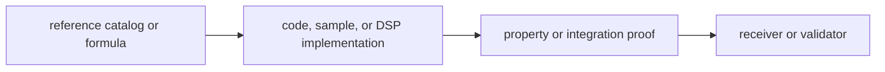

# Tests

This file maps signal-layer proof. Signal tests protect reference-aligned
catalogs, deterministic code generation, reusable DSP behavior, raw-IQ sample
contracts, and observation compatibility.

## Test Flow



## Entry Points

The signal crate uses a broad integration test suite because reference behavior
matters more here than internal rearrangement.

Key families:

- registry and reference tests for GPS, Galileo, BeiDou, and GLONASS signal definitions
- long-duration continuity tests for code phase, carrier wipeoff, NCO behavior, and replicas
- spectrum tests for BPSK, CBOC, and front-end filtered responses
- raw-IQ metadata and sample-conversion tests
- property tests for C/A code, NCO behavior, and observation validation

## Support Fixtures

- `tests/data/` contains checked-in reference catalogs
- `tests/support/` contains independently generated reference helpers and validation support

## Protection Matrix

| proof family | protects |
| --- | --- |
| registry/reference tests | constellation and signal metadata compatibility |
| long-duration continuity | chunk-stable code, carrier, and NCO behavior |
| spectrum tests | modulation and front-end physical coherence |
| raw-IQ/sample tests | metadata and sample-conversion contracts |
| property tests | broad edge behavior for reusable primitives |

- code generators remain reference-aligned
- long-duration sampling behavior stays chunk-stable
- signal spectrum and front-end computations remain physically coherent
- exported signal metadata stays compatible with downstream crates
- reusable DSP helpers remain trustworthy without depending on receiver orchestration

## Verification

Useful commands from the repository root:

```sh
cargo test -p bijux-gnss-signal --test integration_signal_component_registry
cargo test -p bijux-gnss-signal --test integration_signal_spectrum_cboc
cargo test -p bijux-gnss-signal --test prop_obs_epoch_validation
```

## Review Checks

- Which reference, formula, or physical assumption changed?
- Does the proof exercise reusable signal behavior rather than receiver state?
- Are downstream compatibility effects visible in metadata or validation tests?
