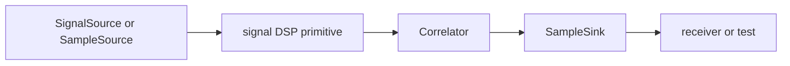

# Traits

`bijux-gnss-signal` exposes a small set of reusable trait seams for sample and
correlation flows. These traits keep signal-facing code generic without pulling
receiver runtime policy, artifact persistence, or command workflow concerns into
the signal crate.

## Trait Flow

## Public Trait Surface

| trait | responsibility | not responsible for |
| --- | --- | --- |
| `SignalSource` | Stream sample frames with sample-rate and end-of-stream behavior visible. | Receiver scheduling, acquisition policy, or artifact layout. |
| `SampleSource` | Provide a minimal sample-frame source for callers that do not need full signal metadata. | Runtime logging or command input interpretation. |
| `Correlator` | Abstract reusable correlation behavior near signal math. | Channel lock lifecycle or receiver diagnostics. |
| `SampleSink` | Accept sample output in reusable signal/test flows. | Repository run layout or durable artifact naming. |

## Boundary Rules

- Traits here must stay minimal and signal-adjacent.
- A new trait method needs a signal-domain reason, not a receiver convenience
  shortcut.
- Error associated types must let callers preserve source-specific failures
  without forcing a repository or CLI error type into this crate.
- Artifact persistence and runtime orchestration belong outside this trait layer.

## Review Checks

- New trait implementations should include deterministic sample or correlation
  tests.
- A trait that starts mentioning command flags, run directories, or receiver
  channels belongs in another crate.
- Public trait changes are compatibility-sensitive and need changelog coverage
  when they affect downstream implementers.
