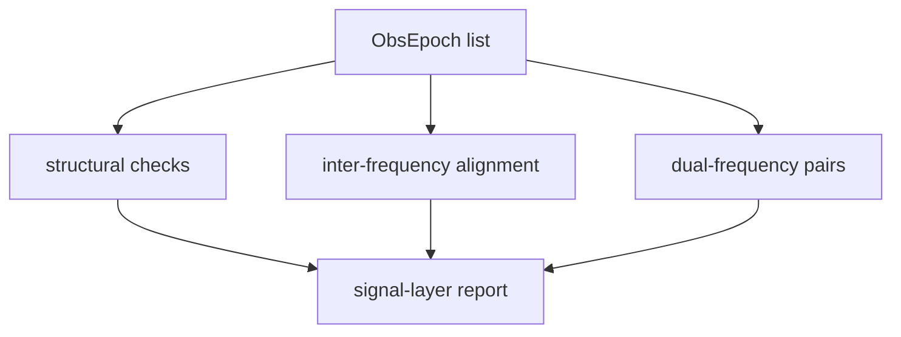

# Validation

`bijux-gnss-signal` owns signal-layer compatibility validation. It can say
whether observation epochs are structurally usable from a signal perspective; it
must not decide whether a receiver run, navigation solution, or operator
workflow is acceptable.

## Owned Reports

| report | purpose |
| --- | --- |
| `InterFrequencyAlignmentReport` | records missing-band lag events across observation epochs |
| `DualFrequencyObservationReport` | records whether supported same-satellite band pairs are complete and lock-valid |
| `validate_obs_epochs` | checks monotonic epoch time, duplicate signal IDs, finite observables, non-negative variances, CN0 bounds, and known metadata labels |

## Validation Flow

## Contract Rules

- Validation uses shared `bijux-gnss-core` observation records and convention
  bounds; it does not redefine observation semantics.
- Dual-frequency checks are about compatible signal support and lock validity,
  not about ionosphere-free solution quality.
- Alignment lag is evidence for downstream analysis, not an automatic receiver
  or navigation failure.
- Unknown Doppler and lock-state labels are rejected because downstream readers
  cannot safely interpret them.

## Not Owned Here

- receiver lock-state generation belongs to `bijux-gnss-receiver`
- solution acceptance, refusal, residuals, and covariance belong to
  `bijux-gnss-nav`
- artifact persistence and report discovery belong to `bijux-gnss-infra`
- command-level pass/fail presentation belongs to `bijux-gnss`

## Proof Surfaces

- `src/obs_validation.rs`
- `tests/prop_obs_epoch_validation.rs`
- receiver observation integration tests that consume these reports
