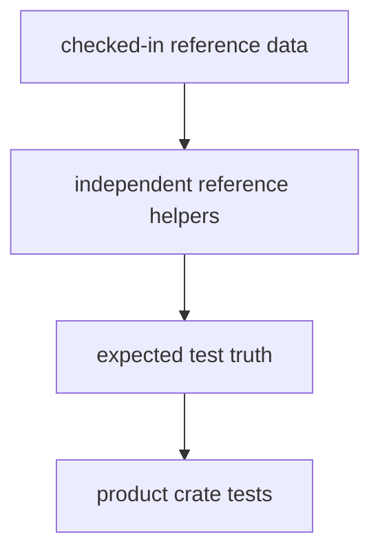

# bijux-gnss-testkit API

`bijux-gnss-testkit` exposes shared GNSS test truth, fixtures, geometry helpers,
and independent reference helpers. Its API is for tests and validation support,
not production receiver or navigation execution.

## API Map

| module | responsibility | use when |
| --- | --- | --- |
| `fixtures` | Deterministic fixture loading and typed scenario inputs. | A test needs shared checked-in evidence instead of local ad hoc setup. |
| `reference_data` | Public reference records such as station truth and derived validation inputs. | Multiple crates need the same baseline data. |
| `position_truth` | Position truth helpers used by navigation and receiver tests. | A test needs expected position behavior independent from production solvers. |
| `antenna` | Antenna truth helpers and reference calculations. | Antenna model tests need a reusable truth source. |
| `signal` | Signal truth and deterministic sample helpers for tests. | Signal or receiver tests need independently generated expected behavior. |
| `geometry` | Shared geometry helper functions for test assertions. | A test needs comparison logic without importing production estimator internals. |

## Boundary Rules

- Testkit helpers must stay independent enough to catch product regressions.
- Shared fixtures belong here when more than one crate relies on the same
  evidence or when the evidence has durable scientific value.
- One-off setup for a single test file belongs beside that test, not in testkit.
- Production receiver and navigation algorithms must not depend on this crate.

## Review Checks

- New public helpers need an independence argument: why this does not merely wrap
  the implementation under test.
- New reference data needs provenance, unit meaning, and at least one consumer.
- New fixtures must be deterministic and safe to run in parallel tests.
