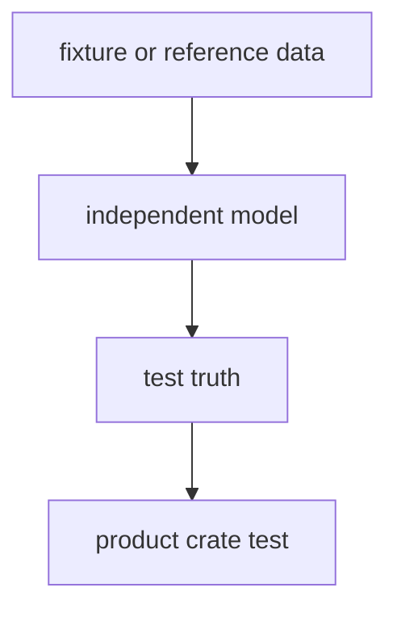

# bijux-gnss-testkit

`bijux-gnss-testkit` owns shared GNSS test truth, fixtures, and independent
reference models. It exists so product crates can test against evidence that is
not just a wrapper around the implementation under test.

Start here when a test needs reusable truth data, fixture loading, independent
reference-model calculations, or deterministic signal/observation synthesis. Do
not start here for production receiver orchestration, navigation solver
implementation, repository persistence rules, or one-off wrappers.

## Reader Route

| question | go next |
| --- | --- |
| Which fixture or reference dataset is shared? | [Fixture guide](docs/FIXTURES.md), [Reference data guide](docs/REFERENCE_DATA.md) |
| Which independent model computes expected behavior? | [Truth model guide](docs/TRUTH_MODELS.md), `src/reference_models/` |
| Which antenna or signal truth helper is available? | [Antenna guide](docs/ANTENNA.md), [Signal guide](docs/SIGNAL.md) |
| Which Rust API is public? | [Package API](API.md), `src/lib.rs` |
| How is independence protected? | [Independence guide](docs/INDEPENDENCE.md), `tests/scientific_independence.rs` |
| What changed in this package? | [Package changelog](CHANGELOG.md) |

## Owned Boundary

- deterministic fixture loading across crates
- checked-in reference datasets used as shared test evidence
- independent reference models used to compute expected behavior
- truth generation for acquisition, antenna, observation, and position tests

This crate does not own production receiver orchestration, navigation solver
implementations, repository persistence rules, or throwaway test-only wrappers
around the same helper being tested.



## Source Map

- `src/fixtures.rs` owns deterministic typed fixture loading.
- `src/reference_data/` owns checked-in public truth inputs and derived records.
- `src/reference_models/` owns private independent scientific models.
- `src/position_truth/`, `src/antenna/`, and `src/signal/` own reusable
  truth-generation helpers.

## Documentation Map

- [Architecture guide](docs/ARCHITECTURE.md)
- [Package API](API.md)
- [Antenna guide](docs/ANTENNA.md)
- [Boundary guide](docs/BOUNDARY.md)
- [Contract guide](docs/CONTRACTS.md)
- [Fixture guide](docs/FIXTURES.md)
- [Signal guide](docs/SIGNAL.md)
- [Public API](docs/PUBLIC_API.md)
- [Reference data guide](docs/REFERENCE_DATA.md)
- [Test guide](docs/TESTS.md)
- [Truth model guide](docs/TRUTH_MODELS.md)
- [Independence guide](docs/INDEPENDENCE.md)

## Verification Focus

Use independence tests when changing shared truth:

```sh
cargo test -p bijux-gnss-testkit --test scientific_independence
cargo test -p bijux-gnss-testkit --test integration_guardrails
```

Repository-wide lanes and package routing are documented in the
[workspace README](../../README.md).
