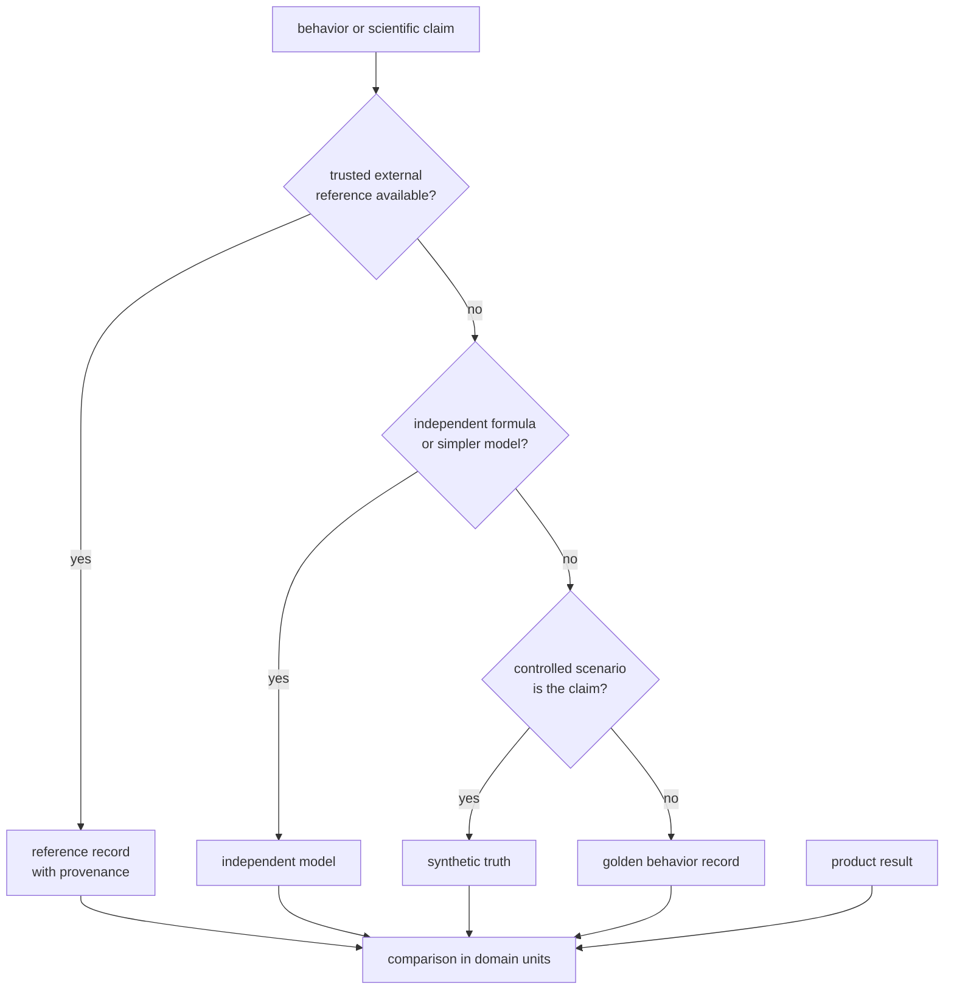
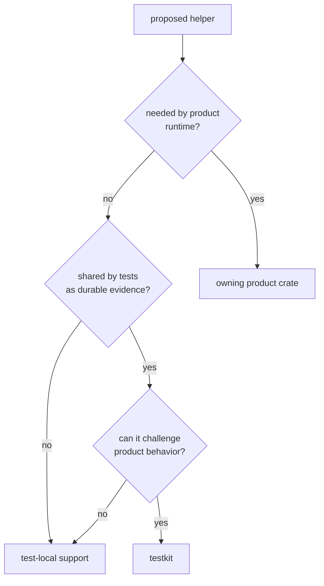

# bijux-gnss-testkit

`bijux-gnss-testkit` provides shared evidence for GNSS tests: typed fixture
loading, checked-in reference records, independent geometry, deterministic
position and signal truth, and controlled antenna effects. It is
repository-only and is never linked into product runtime.

Use it when an expected value deserves a shared, reviewable source. Keep
one-test setup beside that test, especially when extracting it would only hide
the implementation being exercised.

## Choose Evidence By The Claim

Evidence strength is not determined by where a file lives:

- A public reference with source, epoch, frame, and units can challenge a
  scientific result.
- An independently derived formula can expose a production implementation
  error.
- Synthetic truth proves behavior under its declared assumptions.
- A golden file produced by product code protects repeatability, not scientific
  correctness.

Label the evidence honestly so a green test is not interpreted as a stronger
claim than it supports.

## Public Evidence Families

The crate exposes six modules directly:

| Module | Intended use |
| --- | --- |
| `fixtures` | load shared TOML, dataset-style, and JSON records deterministically |
| `reference_data` | consume curated station, coordinate, troposphere, PPP, and RTK evidence |
| `geometry` | compare coordinate and local-frame behavior through a separate implementation path |
| `position_truth` | build observations, ephemerides, biases, and position scenarios with declared truth |
| `signal` | derive expected acquisition phase and controlled sample streams |
| `antenna` | apply deterministic antenna effects for PPP and RTK tests |

Private reference models are implementation details. Consumers should bind to
the evidence and typed helpers they produce, not to the internal model layout.
The [public API guide](docs/PUBLIC_API.md) records the supported module surface.

## Independence Requires Review

The package depends on production-domain crates because its fixtures and
expected records use their public types. That dependency does not make a truth
calculation independent. Independence comes from a separate source, formula,
algorithm, or deliberately controlled assumption.

The executable independence backstop scans a fixed set of truth-producing
source files for a fixed list of known production helper names. It can catch a
direct reintroduction of those calls. It cannot detect:

- a new production helper not listed by the test;
- copied constants or formulas carrying the same mistake;
- an equivalent call hidden behind another wrapper;
- a wrong external reference, frame, unit, epoch, or assumption;
- a helper outside the files currently scanned.

The [independence guide](docs/INDEPENDENCE.md) gives the review standard. A new
truth helper should name its source, units, frame, time system, intended product
claim, and concrete consuming assertion.

## Put Shared Support In The Right Place

Reducing duplication is not enough reason to create shared test API. A helper
belongs here when its scientific meaning, provenance, determinism, and value
across tests are durable. Product configuration builders and wrappers around
the implementation under test should remain with their stronger owner.

## Keep Reference Records Reviewable

Every shared reference or fixture should make these facts visible:

- source or explicit synthetic origin;
- units, coordinate frame, signal identity, epoch, and time system;
- deterministic parsing and ordering;
- intended consumers and the claim they compare;
- tolerances or budgets in domain units;
- limitations that prevent a broader conclusion.

The [reference-data guide](docs/REFERENCE_DATA.md),
[fixture contract](docs/FIXTURES.md), [position-truth guide](docs/TRUTH_MODELS.md),
and [signal evidence guide](docs/SIGNAL.md) provide family-specific rules.

The [test evidence guide](docs/TESTS.md) explains what the package suite
protects. Reader-visible helper, fixture, and truth changes belong in the
[package release history](CHANGELOG.md), even though this support crate is not
published.
