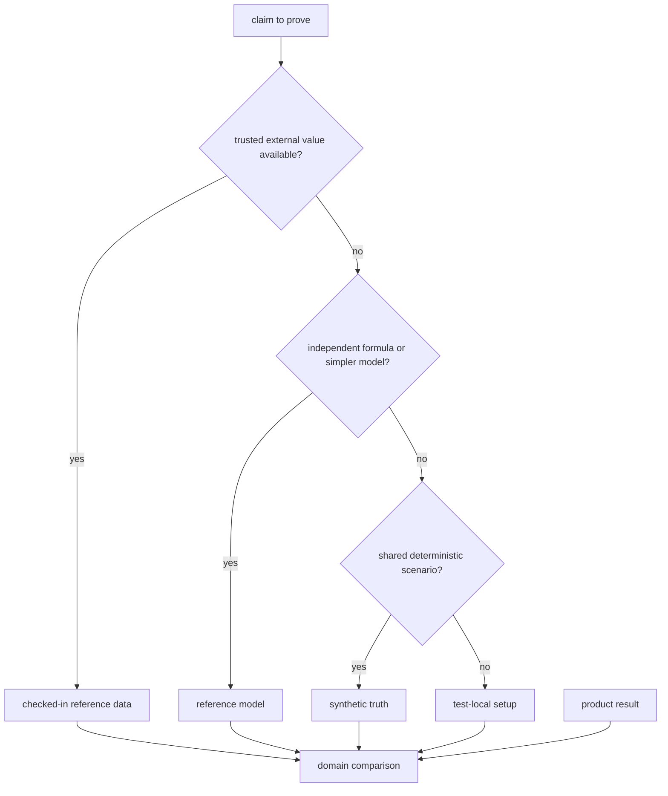
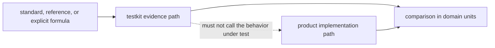
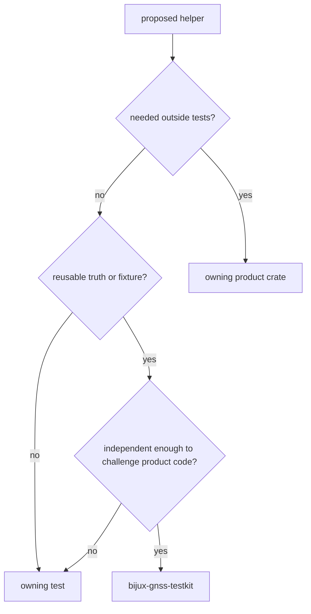

# bijux-gnss-testkit

`bijux-gnss-testkit` supplies reusable GNSS test evidence: checked-in reference
data, deterministic scenarios, typed fixture loading, and calculations designed
to remain independent from production algorithms. It is a workspace support
crate and is not published or linked into product runtime.

Use it when a test needs an expected value that should be shared, reviewed, and
traceable. Keep setup beside the test when it only shortens one test case or
replays the implementation being tested.

## Choose The Evidence First



Prefer evidence in this order:

1. a public or curated reference with provenance, units, frame, and epoch;
2. an independent formula or deliberately simpler algorithm;
3. deterministic synthetic truth whose assumptions are explicit;
4. a stable golden record when behavior, rather than scientific truth, is the
   contract.

A golden file produced by the product implementation is regression evidence,
not independent truth. Label it accordingly.

## What You Can Use

| need | supported surface | read before use |
| --- | --- | --- |
| load shared TOML, dataset-style, or JSON evidence | typed fixture loaders | [Fixture contracts](docs/FIXTURES.md) |
| compare against trusted coordinates, stations, atmosphere, PPP, or RTK records | reference-data modules | [Reference-data provenance](docs/REFERENCE_DATA.md) |
| build observations and position scenarios with known truth | position-truth helpers | [Truth-model boundary](docs/TRUTH_MODELS.md) |
| generate deterministic acquisition or signal expectations | signal truth helpers | [Signal evidence](docs/SIGNAL.md) |
| model controlled antenna effects | antenna truth helpers | [Antenna evidence](docs/ANTENNA.md) |
| understand which modules are supported for test consumers | direct public module surface | [Public API](docs/PUBLIC_API.md) |

The complete public module set is declared by the
[crate entrypoint](src/lib.rs). Private reference models remain implementation
detail; consumers use the evidence they produce rather than binding to their
layout.

## Independence Is A Design Property



The [scientific-independence test](tests/scientific_independence.rs) rejects
known production helper calls from truth-producing modules. It is useful but
not exhaustive: a text check cannot prove that two algorithms do not share the
same mistaken constant, assumption, or derivation. Review every new truth helper
for:

- the independent source of the expected value;
- units, coordinate frame, signal identity, and time system;
- deterministic ordering and reproducible failure;
- the product operation it is intended to challenge;
- a concrete consuming assertion.

If independence is incomplete, state exactly what the evidence can still prove.

## Where New Test Support Belongs



Do not move convenience wrappers here merely to reduce duplication. Shared
support earns a public home when its scientific meaning, provenance, and
cross-test value are durable.

## Verification

Run the independence backstop after changing truth-producing code:

```sh
cargo test -p bijux-gnss-testkit --test scientific_independence
```

Run the package suite when fixture parsing, public helpers, or reference records
change:

```sh
cargo test -p bijux-gnss-testkit
```

The [architecture guide](docs/ARCHITECTURE.md) explains dependency direction,
the [test evidence guide](docs/TESTS.md) states what the package suite proves,
and the [package changelog](CHANGELOG.md) records reader-visible changes.
