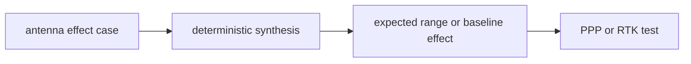

# Antenna

`bijux-gnss-testkit` owns deterministic antenna-effect truth used by higher
level tests. It does not implement production antenna modeling; it builds
controlled evidence that can challenge navigation and receiver behavior.

## Truth Flow

## Owned Responsibilities

- PPP antenna-effect cases with enough satellites to make the correction
  observable
- RTK antenna-effect cases with matching base and rover satellite sets
- deterministic synthesis helpers that keep geometry and expected effects
  inspectable
- reference assertions that protect test independence

## Contract Rules

- Testkit antenna truth must not call production navigation correction code to
  compute the expected answer.
- Cases should carry the geometry and offsets needed for a reviewer to
  understand the expected effect.
- A fixture that depends on command output or persisted run layout does not
  belong here.
- Production antenna corrections remain in `bijux-gnss-nav`; testkit may only
  provide independent evidence against them.

## Not Owned Here

- production antenna model APIs belong to `bijux-gnss-nav`
- receiver observation generation belongs to `bijux-gnss-receiver`
- artifact persistence belongs to `bijux-gnss-infra`

## Proof Surfaces

- `src/antenna/effects.rs`
- `src/antenna/synthesis.rs`
- `tests/scientific_independence.rs`
- PPP and RTK antenna integration tests in navigation
