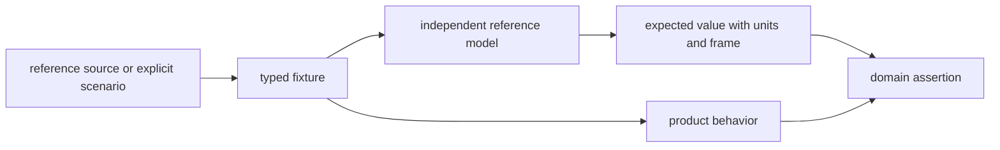
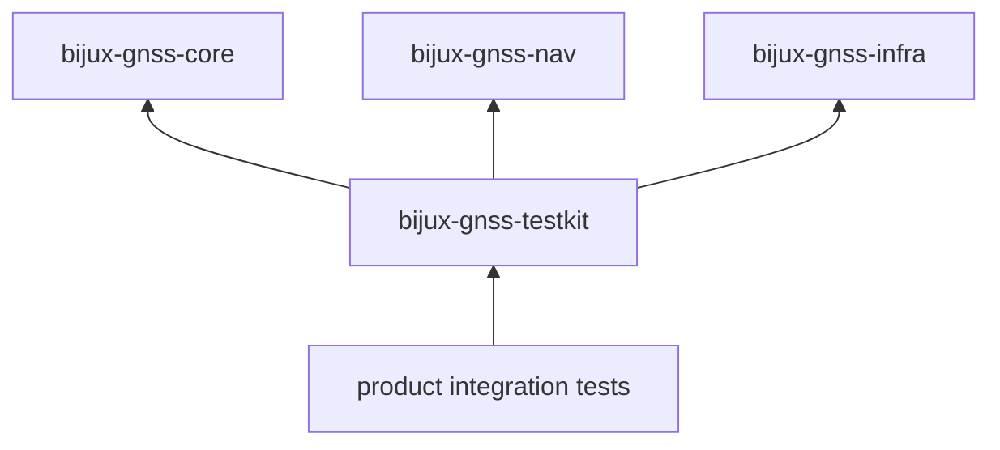
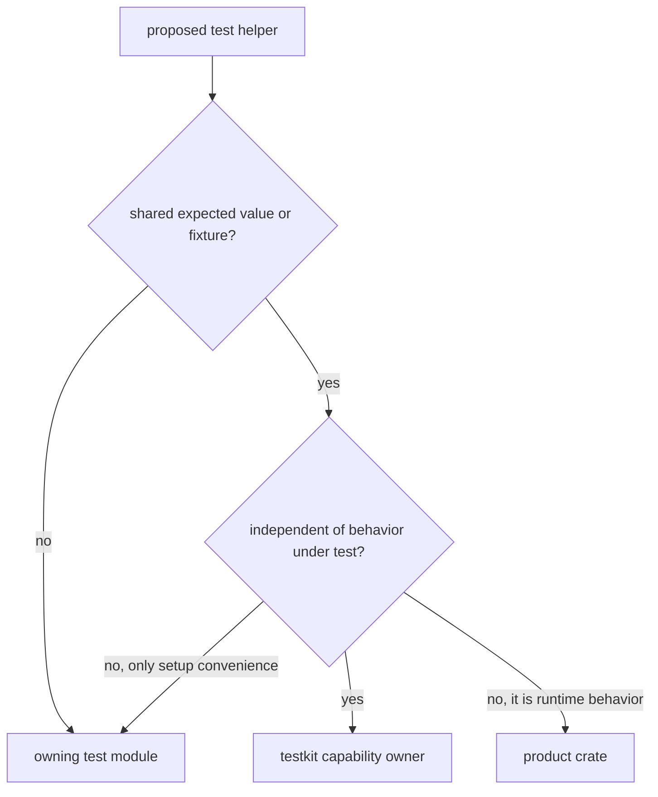

# Test Support Architecture

`bijux-gnss-testkit` provides deterministic inputs and independently derived
expected values for GNSS tests. It is repository-only support code. It does not
ship with the product crates, own their runtime behavior, or serve as a shortcut
around their public contracts.

## Evidence Pipeline

The strongest test compares two paths that share an input but not an
implementation. Calling a production helper from both paths only proves that the
helper agrees with itself.

## Owned Capabilities

The public surface is grouped by the kind of evidence a consumer needs:

| capability | owns | does not own |
| --- | --- | --- |
| [fixture loading](../src/fixtures.rs) | typed TOML, dataset-entry, and golden JSON loading | repository dataset discovery or production persistence |
| [signal truth](../src/signal/mod.rs) | deterministic synthesis and acquisition expectations | receiver acquisition or tracking control flow |
| [position truth](../src/position_truth/mod.rs) | synthetic observations, residuals, clock behavior, and scenario catalogs | the navigation solver being evaluated |
| [antenna truth](../src/antenna/mod.rs) | controlled antenna effects and synthesis inputs | runtime antenna correction policy |
| [reference data](../src/reference_data/mod.rs) | trusted coordinates, station truth, convergence evidence, troposphere comparisons, and RTK cases | downloading, refreshing, or publishing datasets |
| [geometry helpers](../src/geometry.rs) | small test-facing coordinate and geometry calculations | a competing production geometry API |

Independent formulas that should not become part of the public helper surface
remain behind the crate's private
[reference-model boundary](../src/reference_models/mod.rs). Public modules may
use those models to produce evidence, while tests consume the resulting typed
records and functions.

## Dependency Direction

These dependencies are acceptable because the testkit builds product-compatible
inputs. They do not grant permission to calculate expected results through the
same navigation or infrastructure operation under test.

The [scientific-independence check](../tests/scientific_independence.rs) rejects
known production geometry, differencing, acquisition-phase, and correction
helpers from truth-producing modules. That check is a backstop, not a complete
proof of independence. Review must still compare algorithms, constants, and data
provenance.

## Choosing Where A Helper Belongs

Use the testkit when a helper provides reusable scientific evidence, a stable
fixture contract, or a reference calculation with a clear consumer in more than
one test context. Keep setup local when it exists only to shorten one test.
Move behavior to a product crate when callers need it outside tests.

## Evidence Requirements

Every shared truth surface should make the following recoverable from code,
fixture metadata, or its owning guide:

- provenance and any transformation from the source;
- physical units, coordinate frame, constellation, signal, and time system;
- deterministic inputs, ordering, and error behavior;
- the distinction between measured reference data and synthetic truth;
- the expected tolerance and why it is scientifically meaningful;
- at least one product assertion that consumes the evidence.

Randomized inputs are acceptable only with an explicit seed or a property whose
failure can be reproduced. Network access and mutable external state do not
belong in fixture loading.

## Change Review

For a new or changed helper:

1. identify the product behavior it is intended to challenge;
2. trace the expected value to an independent formula or reference source;
3. confirm the helper does not call the implementation under test;
4. preserve units and frames in names or types;
5. add focused coverage for parsing, edge conditions, or reference values;
6. run the consuming product test, not only the testkit's own suite.

The [fixture guide](FIXTURES.md), [truth-model guide](TRUTH_MODELS.md), and
[boundary guide](BOUNDARY.md) provide the detailed contracts.
