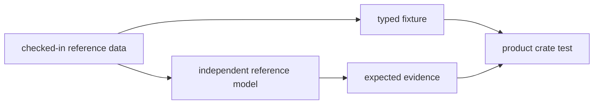

# Boundary

Owner: shared test truth, fixtures, and independent reference models

`bijux-gnss-testkit` owns reusable truth for tests. It should help product
crates prove behavior against independent evidence, not provide convenient
wrappers around the same implementation under test.

## Boundary Flow

## Owned Scope

`bijux-gnss-testkit` owns:

- deterministic fixture loading
- checked-in reference datasets used by tests
- independent reference models used to compute expected behavior
- scenario and truth generation for acquisition, observation, antenna, and position tests

## Out Of Scope

- production receiver orchestration
- navigation solver implementations
- infrastructure run layouts or operator CLI behavior
- test helpers that simply call the same runtime helper the test is supposed to validate

## Independence Rule

Where practical, this crate computes truth through reference models or explicit
formulas instead of leaning on the same `nav` or `receiver` helper stack used in
production. The scientific independence test exists to keep that boundary
honest.

## Effect Model

This crate may read checked-in reference files and expose deterministic helper
functions. It should not own mutable repository workflows or runtime side
effects outside test support.

## Review Checks

- Does the helper preserve independence from the implementation being tested?
- Is fixture provenance clear enough for a future failure investigation?
- Does shared truth belong here, or is it a one-test local fixture?
