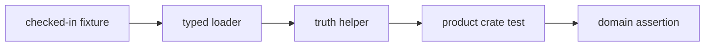

# Fixtures

`bijux-gnss-testkit` owns fixture access as a typed, shared test contract.
Fixtures are checked-in evidence used by multiple tests or crates; they are not
local scratch inputs hidden behind ad hoc path logic.

## Fixture Flow

## Fixture Responsibilities

| fixture family | responsibility |
| --- | --- |
| reference TOML payloads | Load maintained scenario and truth inputs with explicit parsing failures. |
| dataset-style entries | Provide test-facing dataset records without importing repository dataset discovery policy. |
| JSON and golden records | Supply stable expected evidence across crate boundaries. |
| shared path helpers | Resolve checked-in test evidence deterministically from repository-relative context. |

## Boundary Rules

- Checked-in test evidence may be loaded here when it has shared value.
- Repository-wide dataset discovery policy belongs to `bijux-gnss-infra`.
- Production persistence and run layout do not belong here.
- One-off setup for a single integration test belongs beside that test unless it
  becomes reusable truth.

## Review Checks

- New fixtures need provenance, units, coordinate frame or time-system context,
  and at least one concrete consumer.
- Loader errors should identify the fixture and parsing contract that failed.
- Fixtures must be deterministic and safe for parallel test execution.
